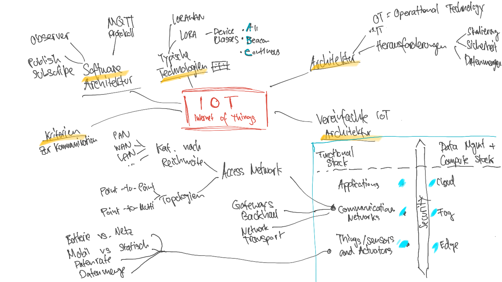

# Internet of Things

## Internet der Dinge

* Das Internet der Dinge \(engl.: Internet of Things, IoT\) ist in aller Munde und auch in den Medien zunehmend ein Thema. Das IoT erweitert die bekannten Konzepte von „jederzeit“ \(**anytime**\) und „an jedem Ort“ \(**any place**\) zur Konnektivität von „allem“ \(**anything**\).
* Beispiele
  * Smarthome
  * Smart Parking
  * Smart Health
  * Smart Shopping

## Architekturen von IoT-Systemen

* OT =  Operational Technology / Betriebstechnik = OT der Einsatz von Computern zur Überwachung oder Änderung des physikalischen Zustands eines Systems, 

### Architektonische Herausforderungen

## Vereinfachte  IoT Architektur

* Gemeinsamkeiten der Architekturmodelle
  * sie teilen das IoT in Schichten auf
  * dass die IoT-Endpunkte mit einem Netzwerk verbunden sind
* 

### Core IoT Functional Stack

<table>
  <thead>
    <tr>
      <th style="text-align:left">Layer</th>
      <th style="text-align:left">Beschreibung</th>
    </tr>
  </thead>
  <tbody>
    <tr>
      <td style="text-align:left">Applications</td>
      <td style="text-align:left"></td>
    </tr>
    <tr>
      <td style="text-align:left">Communications Network</td>
      <td style="text-align:left">
        
Das Kommunikationsnetzwerk f&#xFC;r IoT-Systeme ist in mehrere Ebenen
          unterteilt.

        <ul>
          <li><b>Access Network</b>
            <ul>
              <li>wichtigen Parameter bei der Wahl der Zugriffstechnologie ist die Reichweite.</li>
              <li>Eine <b>Kategorisierung nach Reichweite</b> kann folgendermassen aussehen:
                <ul>
                  <li><b>PAN</b> (personal area network): Das ist der Raum um eine Person herum
                    (Wearables). Oft wird Bluetooth eingesetzt. Ant+ und MiWi sind weitere
                    Technologien</li>
                  <li><b>HAN</b> (home area network): Innerhalb einer Wohnung oder eines Geb&#xE4;udes
                    im Bereich einiger 10m. ZigBee, Z-Wave, Thread (6LoWPAN), BLE und viele
                    weitere</li>
                  <li><b>NAN</b> (neighborhood area network): Gruppe von Geb&#xE4;uden im Bereich
                    weniger 100m. Wi-SUN, ZigBee NAN (beide 6LoWPAN) und viele weitere.</li>
                  <li><b>FAN</b> (field area network): Hier ist meist eine Anwendung draussen
                    im Bereich einiger 10 &#x2013; 100m gemeint. Oft sind FANs unsicher und
                    nicht kontrollierbar. ISA 100.11a (6LoWPAN), WirelessHART, viele weitere.</li>
                  <li><b>LAN</b> (local area network): bis etwa 100m, meist im Geb&#xE4;ude.
                    LAN ist eine gebr&#xE4;uchliche Bezeichnung in der IT-Welt und wird daher
                    oftmals in IoT-Systemen verwendet, wenn die Dinge mit Standardnetzwerktechnologien
                    wie IEEE 802.11 vernetzt sind.</li>
                </ul>
              </li>
              <li><b>Topologien</b>
                <ul>
                  <li><b>Point-to-point topology: </b>Diese Topologie erm&#xF6;glicht die Kommunikation
                    von einem Punkt zu einem anderen. In IoT-Systemen ist die reine Form von
                    Punkt-zu-Punkt-Verbindungen kaum realistisch, denn meist verbinden sich
                    mehrere Sensoren mit einem Gateway. Man spricht trotzdem von Punkt-zu-Punkt-Verbindung,
                    wenn jeder Sensor eine Session mit dem Gateway etabliert.</li>
                  <li><b>Point-to-multipoint topology: </b>In dieser Topologie kommuniziert
                    ein Ger&#xE4;t mit mehreren anderen. Die meisten IoT-Technologien, wo ein
                    oder mehrere Gateways mit einer Vielzahl von smarten Objekten kommunizieren,
                    fallen in diese Kategorie.</li>
                </ul>
              </li>
            </ul>
          </li>
          <li><b>Gateways und Backhaul Network</b>
            <ul>
              <li>Die &#xFC;ber das Access Network gesammelten Daten m&#xFC;ssen zur Zentrale
                meist &#xFC;ber ein anderes Medium &#xFC;bertragen werden. Dieses Medium
                wird Backhaul Network genannt.</li>
              <li>Backhaul Networks
                <ul>
                  <li>Unterscheidung in Datendurchsatz, Reichweite und Energiebedarf.</li>
                  <li>Ethernet</li>
                  <li>WiFi (2.4, 5GHz)</li>
                  <li>802.11ah</li>
                  <li>WiMAX</li>
                  <li>GSM</li>
                </ul>
              </li>
            </ul>
          </li>
          <li><b>Network Transport</b>
          </li>
          <li><b>IoT Network Management</b>
          </li>
        </ul>
        

      </td>
    </tr>
    <tr>
      <td style="text-align:left">Things: Sensors and Actuators</td>
      <td style="text-align:left">
        <ul>
          <li><b> Batteriebetriebene oder netzverbunden</b>: Je nachdem welche Energiequelle
            zur Verf&#xFC;gung steht, sind Dinge mehr oder weniger mobil oder weisen
            eine mehr oder weniger hohe Datenrate und Reichweite der Funk&#xFC;bertragung
            auf. Bei batteriebetriebenen Dingen ist die begrenzte Lebensdauer der Energiequelle
            ein limitierender Faktor.</li>
          <li><b>Mobil oder statisch:</b> Es gibt Sensoren, welche station&#xE4;r betrieben
            werden k&#xF6;nnen (Temperaturmessung an einem bestimmten Ort) wie auch
            mobile Sensoren, welche mehr oder weniger h&#xE4;ufig den Standort wechseln.
            Je mobiler der Sensor, desto h&#xF6;her sind die Anforderungen an die Energieversorgung.</li>
          <li><b>Datenrate:</b> Je nach dem was gemessen wird, ist eine entsprechende
            Datenrate erforderlich. W&#xE4;hrend die Lufttemperatur nur alle paar Minuten
            gemessen wird, m&#xFC;ssen Beschleunigungsdaten zur Vibrationserkennung
            bis hin zu kHz gemessen werden. Das hat einen Einfluss auf die Energieversorgung.</li>
          <li>
            
<b>Datenmenge: </b>Ein Feuchtigkeitssensor muss nur einen Wert &#xFC;bermitteln
              (z.B. 0 ... 100), eine Maschine hingegen muss einen ganzen Report aus einer
              grossen Anzahl Sensoren &#xFC;bermitteln, um den Status der Maschine mitzuteilen.
              Die Anforderungen an die Energieversorgung h&#xE4;ngen mit der Datenrate
              zusammen, mit welcher die Daten &#xFC;bertragen werden m&#xFC;ssen.

            
&#x2022; Reichweite: Je nach Anwendungsfall ist die Reichweite sehr unterschiedlich
              und kann von wenigen Zentimeter (z.B. Fitness-Armband) bis zu einigen Kilometern
              (z.B. Feuchtigkeitssensor in einer Br&#xFC;cke) betragen.

          </li>
          <li><b>Dichte der Dinge pro Fl&#xE4;che: </b>Es ist wiederum abh&#xE4;ngig
            vom Anwendungsfall, wie viele Sensoren pro Fl&#xE4;che ben&#xF6;tigt werden.
            So werden &#xD6;lpipelines mit wenigen Sensoren alle paar Kilometer &#xFC;berwacht,
            w&#xE4;hrend das SETI Colossus Telescope tausende Spiegel auf kleiner Fl&#xE4;che
            aufweist, welche alle mit mehreren Sensoren ausgestattet sind. Die Anzahl
            der Dinge hat einen Einfluss auf die Kommunikationsnetzwerke, welche mit
            der entsprechenden Anzahl pro Gateway klarkommen m&#xFC;ssen.</li>
        </ul>
      </td>
    </tr>
  </tbody>
</table>

### IoT Data Management and Compute Stack

| ... Computing |  |
| :--- | :--- |
| Cloud |  |
| Fog |  |
| Edge |  |

## IoT Software Architektur

### Observer-Pattern

### Publish-Subscribe-Pattern

### MQTT Protokol

* MQTT \(Message Queuing Telemetry Transport\)
* Publisher und Subscriber kontaktieren sich **nie direkt.** 
* **Immer über dritte Komponente \(BROKER\)**
* MQTT gibt es 3 **QoS Level:**

  • QoS 0 - maximal einmal: die Nachricht wird nur einmal verschickt.

  • QoS 1 - mindestens einmal: die Nachricht wird min. einmal empfangen.

  • QoS 2 - genau einmal: die Nachricht wird genau einmal empfangen.

  \*\*\*\*

#### Sicherheit in MQTT ist in mehrere Ebenen unterteilt. 

* • Netzwerk Layer
* • Transport Layer
* • Application Layer

### Kriterien zur Kommunikation im IoT

* Technologien die
  * bereits verbreitet sind 
  * einfach in Betrieb genommen, wartungsfreundlich und zuverlässig sind.
  * sicher und safe
  * energieeffizient sind
  * für einen bestimmten UseCase angemessen

### Einteilung typischer Kommunikationstechnologien

* LoRa = Long Range Radio
* LoRaWAN = Long Range Wide Area Network
* LPWAN = Low Power Wide Area Network 

#### LoRaWAN device classes

* A = ALL
* B = BEACON
* C = CONTINOUS

 

 

## Security

### Generelle Herausforderungen und Gefahren

* viele Hersteller 
* Geräte im Dauerbetrieb und ständig mit dem Netzwerk verbunden und erreichbar.
* Datenkommunikation  «Klartext»

  \(z.B. Login/Passwort, Datenaustausch\) d.h. nicht verschlüsselt.

* Es werden keine Sicherheitsupdates durchgeführt

### Generelle Sicherheitsmassnahmen

* Sichere Entwicklung:
* Verschlüsselung der Daten
* Datenschutz
* Zugangsverwaltung

