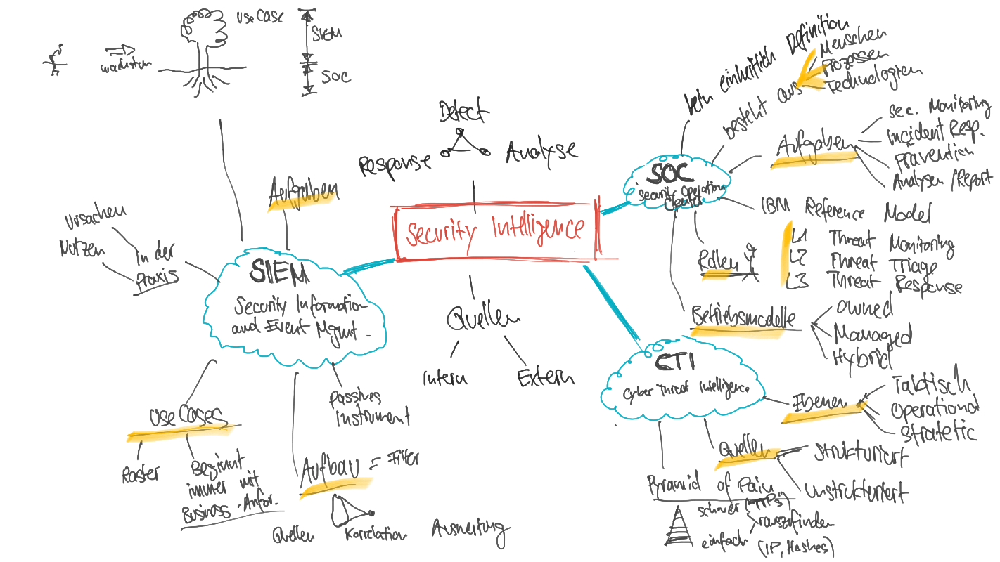

# Security Intelligence

## Security Intelligence

* **Grund** für Security Intelligence
  * Advanced Threats
  * Sophisticated Attacks
* **Hauptmerkmal** = Beschaffen von Informationen von **internen** Systemen einerseits, sowie von **externen Quellen** und das **analytische Zusammenführen dieser beiden Sichten** 
* **Tätigkeiten**
  * Gefahren zu erkennen \(**Detect**\),
  * zu Bearbeiten \(**Analyse**\)
  * entsprechend Abzuwehren \(**Response**\)
  * ebenfalls oft Design von SOC/SIEM Use Cases

* **Active Defense**
  * Nicht der aktive Gegenschlagen
  * Angreifer in die Irre leiten oder deren Aktivitäten verzögern
  * 5D Modell of Defense
    * Deny
    * Disrupt
    * Degrade
    * Deceive
    * Destroy
* **Implementierung** in der Praxis ist ein **komplexes Unterfangen, mehr organisatorisches Projekt.**
* Drei Bereiche die Massgeblich zur **Funktion** beitragen:
  * Security Operation Center \(SOC \), 
  * die Cyber Threat Intelligence \(CTI\)
  * sowie das Security Information und Event Management \(SIEM \).
* Security Intelligence in den Regulatorien und Information Security Standard Verschiedene Frameworks
  * ISO
  * NIST
  * BSI-Standard
  * SANS
  * IBM Security
  * EU Bestimmungen
  * Minimum ICT Standard
* Was sind Advanced Threats?
  * Schnelle Anpassungen von Threats \(Bsp. Pandemie, wird direkt ausgenutzt\)
  * Fürher: Angriffe von Aussen - mit Firewall/WAF geschützt, heute Angriffe nach innen geholt, z.B. durch Phishing
* Was ist eine risk-centric \(Riskorientierte\) Security Strategie?
  * Security war lange ein reines formales Thema
  * Mann muss wissen auf was mal schauen soll. WAF / Firewall / Proxy / Logs.. sind sehr viele Quellen
  * Verstehen: Was sind die Cyber-Risiken in unserem Unternehmen? =&gt; Die Risiken sind das Zentrum

## Begriffe

<table>
  <thead>
    <tr>
      <th style="text-align:left">Abk.</th>
      <th style="text-align:left">Begriff</th>
      <th style="text-align:left">Beschreibung</th>
    </tr>
  </thead>
  <tbody>
    <tr>
      <td style="text-align:left"></td>
      <td style="text-align:left">Follow-the-Sun</td>
      <td style="text-align:left">Modell, bei dem &#xFC;ber verschiedene Zeitzonen hinweg ein 7/24 Betrieb
        sichergestellt wird (z.B. Callcenter oder auch ein Security Operation Center)</td>
    </tr>
    <tr>
      <td style="text-align:left">EOI</td>
      <td style="text-align:left">Event of Interest</td>
      <td style="text-align:left">Ein m&#xF6;glicherweise sicherheitsrelevanter Vorgang</td>
    </tr>
    <tr>
      <td style="text-align:left"></td>
      <td style="text-align:left">Security Incident</td>
      <td style="text-align:left">Ein als sicherheitsrelevant identifizierter Vorfall</td>
    </tr>
    <tr>
      <td style="text-align:left"></td>
      <td style="text-align:left">Log Management</td>
      <td style="text-align:left">Prozess zur Analyse von Systemlogs zur Identifikation bestimmter Vorkommnisse</td>
    </tr>
    <tr>
      <td style="text-align:left"></td>
      <td style="text-align:left">Security Incident Response Team</td>
      <td style="text-align:left">Eine Gruppe von Experten, die f&#xFC;r die Bearbeitung von kritischen
        Security Incidents beigezogen wird.</td>
    </tr>
    <tr>
      <td style="text-align:left"></td>
      <td style="text-align:left">Security Controls</td>
      <td style="text-align:left">Vorgaben die erf&#xFC;llt sein m&#xFC;ssen um einen definierten Security
        Standard zu gew&#xE4;hrleisten (z.B. Compliance)</td>
    </tr>
    <tr>
      <td style="text-align:left"></td>
      <td style="text-align:left">Security Metric</td>
      <td style="text-align:left">Messgr&#xF6;sse zur Beurteilung der Leistungsf&#xE4;higkeit eines (Security-)
        Prozesses (z.B. Anzahl bestehender Vulnerabilities, Zahl von False positives,
        usw.)</td>
    </tr>
    <tr>
      <td style="text-align:left"></td>
      <td style="text-align:left">Remediation</td>
      <td style="text-align:left">Prozess zur Behebung eines identifizierten, sicherheitskritischen Zustandes
        (Risk Remediation)</td>
    </tr>
    <tr>
      <td style="text-align:left"></td>
      <td style="text-align:left">
        

        
Intelligence

      </td>
      <td style="text-align:left">urspr&#xFC;nglich aus dem milit&#xE4;rische, T&#xE4;tigkeit der Gewinnung
        von Entscheidungs-relevanten Informationen (Analyse) aus Daten von unterschiedlichen
        Quellen</td>
    </tr>
    <tr>
      <td style="text-align:left">SOC</td>
      <td style="text-align:left">Security Operations Center</td>
      <td style="text-align:left"></td>
    </tr>
    <tr>
      <td style="text-align:left">SIEM</td>
      <td style="text-align:left">Security Information and Event Management</td>
      <td style="text-align:left"></td>
    </tr>
    <tr>
      <td style="text-align:left">CTI</td>
      <td style="text-align:left">Cyber Threat Intelligence</td>
      <td style="text-align:left"></td>
    </tr>
    <tr>
      <td style="text-align:left">CSIRT</td>
      <td style="text-align:left">Cyber Security Incident Response Team</td>
      <td style="text-align:left"></td>
    </tr>
  </tbody>
</table>

## **SOC \(**Security Operations Center\)

* **keine einheitliche Definition**, es gibt verschiedene

  Gemeinsam haben Sie aber: Prozesse, Menschen, Technologien erwähnen alle 

* Gemeinsam und Wichtig. **Besteht immer aus:**
  * Menschen
  * Prozessen
  * Technologie
* Gibt Empfehlung z.H. von Betrieb / Operation / GL ab
* Klare Abgrenzungen und Kompetenzen in "Playbooks" festzuhalten
* **Ziel** hat, sicherheitsrelevante Vorgänge zu  erkennen und durch geeignete Massnahmen zu verhindern

### Aufgaben

* In der Praxis sind die Grenzen oft fliessend, Ausgestaltung und Benennung kann stark unterscheiden

#### 4 Hauptaufgaben

<table>
  <thead>
    <tr>
      <th style="text-align:left">Name</th>
      <th style="text-align:left">Beschreibung</th>
    </tr>
  </thead>
  <tbody>
    <tr>
      <td style="text-align:left">Security Monitoring</td>
      <td style="text-align:left">
        
manuelle oder automatisierte Auswertung von Log Informationen werden

        
relevante Vorga&#x308;nge (Incidents) identifiziert

      </td>
    </tr>
    <tr>
      <td style="text-align:left">Incident Response</td>
      <td style="text-align:left">In kritischen F&#xE4;llen, z.B. bei laufenden Angriffen, Bedrohungslage
        kurzfristig zu entsch&#xE4;rfen. Incident Response Team (CSIRT) = Oberstes
        Ziel eines CISRT ist es, die Business Continuity zu gew&#xE4;hrleisten</td>
    </tr>
    <tr>
      <td style="text-align:left">Pr&#xE4;vention</td>
      <td style="text-align:left">Pr&#xE4;ventionsauftrag, Interne und Externe Informationen zu Nutzen,
        um Risiken weitestgehend zu minimieren.</td>
    </tr>
    <tr>
      <td style="text-align:left">Analysen und Reporting</td>
      <td style="text-align:left">Ein laufendes Reporting f&#xFC;r das Risk- und Compliance Mangement</td>
    </tr>
  </tbody>
</table>

### **Aufgaben eines SOC im Security Control Kontext**

* Directive = Anhaltspunkte das man etwas nicht darf, welche Privilegien darf der Benutzer haben.
* Preventive = Massnahmen um dies umzusetzen 
* Detective = Entdecken . 

### SOC Referenzmodelle

* Es gibt kein allgemein gültiges SOC Modell.
* Wichtig ist die **Adoption**
  * Modell an die realen Bedürfnisse der Organisation adaptieren
  * gemeinsames Verständnis schaffen
* 3 wichtige **Kriterien**
  * Berücksichtigt die Ebenen Governance, Prozesse und Technologie \(doer auch: people, Processes, Technology\) 
  * Bildet die Abhängigkeiten zu externen, relevanten Bereichen ab
  * Prozess nach Prinzip Regelkreis 

#### SOC Core Prozesse am Beispiel des IBM SOC Reference Models

Rollen unterscheiden sich nicht durch den Namen, sondern durch dessen Zielsetzung:

<table>
  <thead>
    <tr>
      <th style="text-align:left">Level</th>
      <th style="text-align:left">Beschreibung</th>
      <th style="text-align:left">Details</th>
    </tr>
  </thead>
  <tbody>
    <tr>
      <td style="text-align:left">L1</td>
      <td style="text-align:left">Threat <b>Monitoring</b> 
      </td>
      <td style="text-align:left">Monitoring s&#xE4;mtlicher Event of Interest (EoI) und Identifikation
        m&#xF6;glicher IoC (Indicators of Compromise). (Ziel: Kurze Durchlaufzeit)</td>
    </tr>
    <tr>
      <td style="text-align:left">L2</td>
      <td style="text-align:left">Threat <b>Triage</b>
      </td>
      <td style="text-align:left">Verifizieren der IoC, Identifikation m&#xF6;glicher Incidents und deren
        Kritikalit&#xE4;t. (Ziel: Genaue Analyse)</td>
    </tr>
    <tr>
      <td style="text-align:left">L3</td>
      <td style="text-align:left">Threat <b>Response</b>
      </td>
      <td style="text-align:left">Weiterbearbeitung der Incidents durch Matter Experts (Ziel: Ergreifen
        der angemessenen Massnahme basierend auf der Kritikalit&#xE4;t)</td>
    </tr>
    <tr>
      <td style="text-align:left">CSIRT Management</td>
      <td style="text-align:left">Cyber Security Incident Response Team</td>
      <td style="text-align:left">
        
Bearbeitung von kritischen Cyber Incidents, welche eine priorit&#xE4;re
          Zusammenarbeit mit anderen Business Funktionen erfordern (z.B. Legal, Compliance,
          Management). Enge Zusammenarbeit mit dem Krisenstab (Emergency Response
          Team) der Organisation. In den meisten Organisationen besteht das CSIRT
          aus einem virtuellen Team.

        

        
=&gt; erweiterte Befugnisse, um in kritischen F&#xE4;llen rasch reagieren
          zu

        
k&#xF6;nnen.

        
=&gt; Konzeptionell nicht Teil des SOC

      </td>
    </tr>
  </tbody>
</table>

#### Warum diese Aufteilung in Levels?

* Grund für diese Aufteilung liegt in den Unterschiedlichen Zielsetzungen und Volumen. 
  * L1 = grössten Arbeitsvolumen, kurze Durchlaufzeit 
  * L2 = Enrichment, umfassenderes Bild = höhere Durchlaufzeiten 
  * L3 = Behebung, der aufwändigste Teil 

### SOC Rollen

### SOC Betriebsmodelle

### Security Analytics

* Während sich das Security Monitoring mit Realtime Daten beschäftigt, nutzt die Security Analytics **Vergangenheitsdaten**
* **Wichtige Bedeutung in**
  * forensische Untersuchung
  * Sicherung von Beweisen \(Chain of Evidence\) 
* Security Analytics unterstützt Incident Response Team oder auch die Security Intelligence

## Cyber Threat Intelligence \(CTI\)

* Analyse ist dabei der entscheidende Faktor. Ohne Analyse bleiben Informationen einfache Daten ohne Kontext.
* Verbindung der Daten zu meinen jeweiligen Absichten \(Kontext\) wird daraus Intelligence
* Definition von Cyber Threat Intelligence \(z.B. nach Gartner\)
  * «Evidence-based knowledge, including context, mechanisms, indicators, implications and actionable advice, about an existing or emerging menace or hazard to assets that can be used to inform decisions regarding the subject's response to that menace or hazard.».
* Es gibt eine Vielzahl von Intelligence Informationen welche sich, je nach Quelle, unterscheiden lassen: 

### Taktische-, Operative und Strategische Intelligence

<table>
  <thead>
    <tr>
      <th style="text-align:left">Ebene</th>
      <th style="text-align:left">Beschreibung</th>
    </tr>
  </thead>
  <tbody>
    <tr>
      <td style="text-align:left"><b>Tactical</b> Threat Intelligence</td>
      <td style="text-align:left">
        <ul>
          <li>h&#xE4;ufigste Form, ad-hoc angewandt</li>
          <li>spezifische Sachverhalte zu einem Incident mittels verf&#xFC;gbarer Quellen
            automatisiert oder manuell zu pr&#xFC;fen</li>
          <li>sehr spezifische Information, wie z.B. eine IP Adresse, eine bestimmte
            Datei oder einzelnes Systemereignis st&#xFC;tzt,</li>
        </ul>
      </td>
    </tr>
    <tr>
      <td style="text-align:left"><b>Operational</b> Threat Intelligence</td>
      <td style="text-align:left">
        <ul>
          <li><b>gr&#xF6;sseren Zusammenhang</b> von einzelnen Ereignissen zu erkennen</li>
          <li>etwas weiteres (aber immer noch relativ spezifisches) Spektrum</li>
          <li>bedient in der Regel Incident Response Teams (IRT) oder auch Forensikspezialisten</li>
        </ul>
      </td>
    </tr>
    <tr>
      <td style="text-align:left"><b>Strategic</b> Threat Intelligence</td>
      <td style="text-align:left">
        <ul>
          <li>Auswertung von Daten, welche sich mit der Bedrohungslage in einem gr&#xF6;sseren
            Kontext besch&#xE4;ftigen</li>
          <li>h&#xE4;ufiges Instrument = z.B. Risk Assessments, oder auch Impact Assessments
            f&#xFC;r bisher unbekannte Cyber Threats.</li>
        </ul>
      </td>
    </tr>
  </tbody>
</table>

### Confidence Level von Cyber Threat Intelligence

* Confidence Level = Massstab für die Zuverlässigkeit einer Information bzw. Quelle
* Es gibt verschiedene Metriken  
* **2 wichtige Faktoren**
  * die Zuverlässigkeit der Quelle insgesamt
  * die Zuverlässigkeit der jeweiligen Daten aus dieser Quelle.

### Strukturierte vs. Unstrukturierte Threat Intelligence Quellen

<table>
  <thead>
    <tr>
      <th style="text-align:left">Quellen</th>
      <th style="text-align:left">Details</th>
    </tr>
  </thead>
  <tbody>
    <tr>
      <td style="text-align:left">Strukturierte</td>
      <td style="text-align:left">
        <ul>
          <li>relativ einfach extrahiert werden k&#xF6;nnen</li>
          <li>Beispiel
            <ul>
              <li>automatisch aktuelle Blocklists f&#xFC;r nach IP Adressen oder Domain
                Names,</li>
              <li>sowie Patterns zur Erkennung von Angriffsmustern erstellen</li>
            </ul>
          </li>
          <li>produzieren meiste eine Vielzahl an Fehlarme (False Positives)</li>
          <li>=&gt; Threat Intelligence l&#xE4;sst
             sich weitgehend nur mit strukturierten Quellen automatisieren</li>
        </ul>
        

        

      </td>
    </tr>
    <tr>
      <td style="text-align:left">Unstrukturierte</td>
      <td style="text-align:left">
        <ul>
          <li>gr&#xF6;sste Teil der Security Informationen</li>
          <li>Form = B&#xFC;chern, Studien, News, Blogs, Foren, Social Media</li>
          <li>Nachteil: die enthaltenen Informationen m&#xFC;ssen zuerst extrahiert
            werden</li>
        </ul>
      </td>
    </tr>
  </tbody>
</table>

### Strukturierte Threat Intelligence Formate

Es gibt eine Vielzahl von Formate

#### STIX \(Structured Threat Intelligence Exchange\) Format

* Version 1 = XML
* Version 2.0 = JSON
* Open Source und die Entwicklung wird durch das Konsortium OASIS koordiniert
* STIX beschreibt Eigenschaften, sowie Beziehungen zwischen den einzelnen Threat Intelligence Information in JSON.

### Pyramid of Pain

* Elemente die Angreifer nur sehr schwer verschleiern kann. 
* Pyramid of Pain zeigt **Zusammenhang zwischen einfachen IOC’s und den komplexeren TTP’s auf**

* **Zentrale Aussage:**
  * « Informationen, welche sich einfach zuordnen lassen, lassen sich in der Regel einfach verändern und haben daher nur eine beschränkte Aussagekraft über die Urheber. Wer sich mit den Urhebern, den verwendeten Tools oder Taktiken auseinandersetzen will, muss einen erheblichen Aufwand in seine Threat Intelligence Prozesse stecken.»

## **SIEM \(**Security Information and Event Management\)

* Umfasst die Tätigkeit, sicherheitsrelevante Vorgänge in der eigenen Organisation möglichst rasch zu erkennen und klassifizieren zu können.
* Wird oft einer Softwarelösung gleichgesetzt, besteht aber aus:

  * Menschen
  * Prozessen
  * Technologie

### Aufgaben der SIEM Prozesse

### Bedeutung von SIEM in der Security Strategie

* in erster Linie zum Erkennen \(Detect\)
* und schafft die Grundlage für die effektive Bearbeitung \(Respond\)
* **Wichtig**: 
  * Das **SIEM** selbst ist **ein passives Instrument**, welches Daten liefert. 
  * Der **Schutz** der Systeme **erfolgt durch die jeweiligen Systeme** wie IDS/IDP, AV, IAM, etc.

### Aufbau einer klassischen SIEM Lösung

| Was | Beschreibung |
| :--- | :--- |
| Quellen \(Data Sources\) | verschiedenen Systemen generierten Log Informationen als Grundlage |
| Event Korrelation | Events in einen Zusammenhang zu bringen |
| Auswertung | Abweichungen vom Normalzustand zu erkennen \(Anomalie Detection\). |

### SIEM Use Case

* Vorgänge aus einer grossen Menge von Daten erkennen
* **SIEM Use Case Modeling**
  * beginnt immer bei den übergeordneten Business Anforderungen.
  * kann sehr umfangreich sein und bildet häufig einer der grossen Kostenblöcke im SIEM Betrieb.

#### UseCase Beispiele 

### SIEM in der Praxis

* Problem bei falschem Einsatz von SIEM Systemen
  * Auswirkungen können Verzögerungen oder erhebliche Mehrkosten sein,
  * Organisation wiegt sich in falscher Sicherheit 
* Häufigsten **Ursachen**
  * ein unterschiedliches Verständnis darüber was SIEM ist
  * das Unterschätzen der Kosten
  * Überschätzen der Fähigkeiten der eigenen Organisation
* Grössten **Nutzen**
  * wenn es laufend ,auf die sich verändernde Situation, eingestellt wird.
  * Grundlage dafür sind eine vorhandene Security Strategie, ein funktionierendes Risk Management und ein effektives Incident Management.

## **NIST Cyber Security Framework \(CSF\)** 

* **N**ational **I**nstitute for **S**tandard and **T**echnology ist eine Regierungsbehörde der US Behörde • 2014 **Erste Version des Cyber Security Frameworks\(CSF\)** zum Schutz vor kritischen

  Infrastrukturen

  • Das CSF besteht aus 3 Teilen, dem **Framework Core**, dem **Framework Profile** und den

  **Implementation Tiers**

  • Wird sowohl von öffentlichen , wie auch privaten Organisationen angewendet

## 

