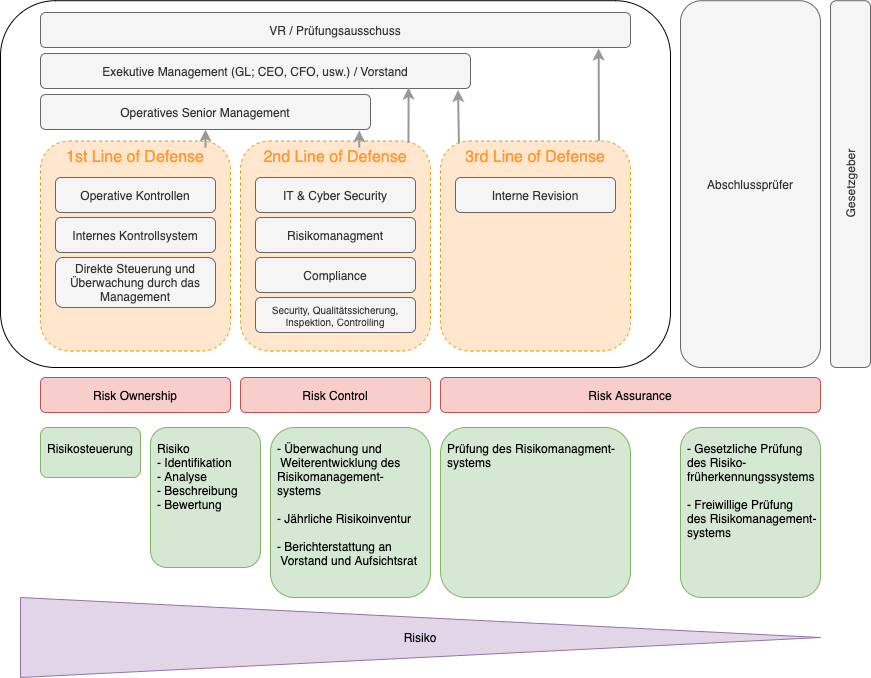

# Informatik - Revision

* Revision =
  * **Nachvollziehen, Analysieren, Beurteilen**
  * Untersuchung durch Unabhängige
  * _Trust but verify_ 
* Auftraggeber
  * Verwaltungsrat \(für intern und extern\)
* Bestätigung von Sachverhalten \(„**Assurance**“ bzw. „re-assurance“ in Verbindung mit dem Internen Kontrollsystem \(IKS\)\) als auch in einschlägiger Beratung \(„**Consulting**“\) in Organisationsfragen 
* Es gibt Interne / Externe Revision \(siehe Kapitel unten\)
  * Interne Revision ist in der 3rd Line of Defense \(siehe Infografik\)
* Verifizieren ob Massnahmen korrekt \(**Design Effectiveness - richtig auf Papier\)** und effektiv \(**Operating Effectiveness - in Betrieb\)** implementiert sind und auch funktionieren
* / durch unabhängige Stelle \(Frühwarnsystem\)
* Soll/Ist-Vergleich - Wie gut sollte und ist das IKS wirklich?
* Haftet - Haftung des Abschlussprüfers 
* **Externe Revision in CH obligatorisch** gem. OR Art. 738: Existenz eines IKS zu prüfen & bestätigen

## **Zentrale Übersicht**

Erklärungen zur Grafik

* **ORANGE**
  * 3 Lines of Defense
    1. Management, Operative Kontrollen
    2. Risikomangement, Compliance, IT Security
    3. Interne Revision
* **ROT**
  * Risk **Ownership**: Risiken ist direkt im Prozess durch das operative Management zu begegnen,
  * Risk **Control**: Kontrolle und Unterstützung der Risikosteuerungs­maßnahmen durch Risikomanagementfunktionen,
  * Risk **Assurance**: Überwachung und Prüfung des Risiko­managementsystems, so dass der Aufsichtsrat seine Entscheidungen auf unabhängige und damit verlässliche Informationen abstützen kann.
* **GRÜN**
  * Aufgaben des Risikomanagements im Ordnungsrahmen
* **VIOLETT**
  * Risiko sollte je tiefer die Linie immer mehr abnehmen
* **SONSTIGES**
  * Abschlussprüfer \(Bspw. Externe Revision\)
    * kann bei kleiner Firmen auch die Funktion der internen Revision übernehmen
  * Gesetzgeber \(Bspw. FINMA, Bund\)

## **Allgemeines**

### **Begriffe**

* **Kontrollen \(Sicherheitsmassnahme\);** 
  * sind die Konzepte, Verfahren, Praktiken und Organisationsstrukturen, welche eine angemessene Gewissheit verschaffen, dass die Geschäfts- ziele erreicht werden und dass unerwünschte Ereignisse verhindert oder erkannt und korrigiert werden
    * .…ist eine Massnahme, welche ein Risiko modifiziert.
    * =&gt; **Wichtiges Hauptziel: Risiken minimieren**
* **Kontrollziel \(Sicherheitsanforderung\)**
  * ist eine Aussage zum gewünschten Resultat \(Zweck\), das mit der Implementierung von Kontrollen in einer bestimmten Aktivität erreicht werden soll.
* **IKS \(ist ein Management-System\);** 
  * inkl. Massnahmen-Paket für die Gesamtheit aller im Unternehmen angewandten Massnahmen  um den Fortbestand der Unternehmung sicherzustellen
  * "Overall" oder das grosse Ganze

* **Scope**
  * Umfang, Geltungs- oder Abdeckungsbereich \(bspw. Service / Prozess / Organisation \(F. 8
* **Prüfung**
  * systematische Verifikation von Beweismitteln;
* **Zertifizierungs-Audit ISO27001** \(für ein ISMS\)
  * Zertifiziert wird nur ein bestimmter Teil \(==&gt; Scope\) - zentral: Compliance; Einhaltung der Vorschriften
  * SOA - Statement of Applicability; Definition welcher der 114 Kontrollen wirklich angewendet werden
  * Stage 1 \(Voraudit\) und Stage 2 Audit \(Zertifizierung\)
* **Revisoren ...**
  * sind neugierig von Beruf und durch Training
  * wurden ausgebildet, gründlich zu sein
  * \(sollten\) ethischen Grundsätzen folgen \(Charta\)
  * Wenn Sie etwas ändern wollen, sind die Revisoren Ihre besten Freunde !

### **Frameworks** \(siehe IKS Frameworks\)

* COSO: Organisation, welche Revisionen "unterstützt" \(Ethisches Handel / Wirksamkeit\)
* Cobit: Generisches Framework für ein Kontrollsystem innerhalb der IT

### **Organigramm**

* unabhängig agierende Stabsstelle für organisationsinterne Prüfungen und einschlägige Beratertätigkeit.
* Unabhängigkeit ist sehr wichtig
* Direkter Draht zum VR, Bsp. GL macht ein Seich

## Aufgaben der Revision

* Kontrolle auf **allen Ebene im "Cremeschnitten-Modell"** \(siehe Grafik unten\)
* Dem Management genügend **Gewissheit** geben, dass die relevanten **Kontrollziele erreicht** werden;
* identifizieren, **wo** in diesen Kontrollen signifikante **Schwachstellen bestehen;**
* das mit einer derartigen Schwachstelle verknüpfte **Risiko belegen**;
* das Management **bezüglich** der zu implementierenden **Massnahmen beraten**

## **Erwartungen der Revision an die Zusammenarbeit**

Um sich optimal auf eine Überprüfung \(Revision/Audit\) jeglicher Art vorzubereiten, ergeben sich folgende Punkte wichtig:

* Transparenz
* Kontrollen die bei mir implementiert sind kennen
* offene Kommunikation
* Ehrlichkeit
* uneingeschränkte Bekanntgabe relevanter Fakten
* **Dokumentation**  \(Sobald Kontrolle durch. Unterschrift, Datum, Screenshot \)
* Nachvollziehbarkeit \(Prüfspur\) -&gt; Nachweis

## Typischen Revisions- Anforderungen an das IKS

* Greif- resp. fassbare Kontrolle
* Übereinstimmung/Anlehnung an Risikomatrix
* 4 Augen-Prinzip, wer die Kontrolle ausführt darf sie nicht selber kontrollieren

Die üblichen Qualitätsanforderungen an ein IKS setzen ebenfalls implizit gewisse Massstäbe an die Ausgestaltung:

* Nachvollziehbarkeit \(z.B. Dokumentation, klare Regelungen\)
* Wirksamkeit \(z.B. Identifikation Risiken, Risikorelevanz\)
* Effizienz \(z.B. MA kennen IKS, IKS ist in Unternehmensprozesse integriert, Kosten-Nutzenverhältnis\)

## Cremeschnitten-Modell  / Kontrollen in der IT

* Vier Schichten = vier vers. Prozess-Ebenen & Ressourcen
  * Wesentliche **Geschäftsprozesse** - aufgeteilt in Teil-Prozesse \(manuell\)
    * R: inhärente Risiken der Geschäftsprozesse \(Konkurs, Währungs-R, etc.\)
    * C: Bonitätsprüfung bei Kreditvergabe, Absicherung Währungsrisiko bei Devisen-Transaktionen
  *  Automatisierte Teile der **Geschäftsprozesse**, resp. die eigentlichen **\(IT-\) Anwendungen**
    * R: im Zusammenhang mit SW; Funktionalität, Codierung, unvollständige Tests, SW-Personal
    * C: Rollen&Workflows, Plausibilitätsprüfungen von Eingaben
  * IT-**Basissysteme** \(DB, Core-Systeme\)
    * R: administrative Zugriffe
    * C: spez. C. von Informatik-Komponenten; Konfigurations- und Parametrierungskontrollen
  * IT-**Infrastruktur** \(HW, Netzwerk\) und dessen bauliche Einrichtungen wie RZ
    * R: Ausfall HW, unberechtiger Zugriff, Würmer/Viren, Elementarschäden; Überschwemmung
    * C: spez. C. von technologieabhängigen C.; Zugriffsschutz, OS-Funktionen zur Überwachung
* Auf jeder dieser Ebenen bestehen typische Risiken \(siehe oben "R: x"\)
* … aber auch entsprechende Kontrollen \(Controls\) \(siehe oben "C: x"\) \(Script S. 14\)

## Revisions**typen**

### **Informatikrevision**

ist definiert als jede Revision, welche die Überprüfung und Beurteilung aller Aspekte von automatisierten, informationsverarbeitenden Systemen \(oder Teilen davon\) umfasst; inklusive der damit zusammen- hängenden nicht-automatisierten Prozesse und ihrer Schnittstellen.

=&gt; siehe auch Cremeschnittenmodell 

### Externe vs. Interne Revision

**Externe Revision \(in der CH obligatorisch\)**

* gesetzlich abgestützt
* Wahl durch GV
* Mindestanforderung an ihre Qualifikation
* unterliegt Organhaftung
* vorwiegend Abschlussprüfung
* eingeschränkte oder ordentliche Revision?
* **Externe Revision in CH obligatorisch** gem. OR Art. 738: Existenz eines IKS zu prüfen & bestätigen

**Interne Revision**

* “**freiwillig**” \(Bankengesetz, ...\) und \(in der Regel\) im Auftrag des VR
* Unterstützung des Verwaltungsrates
* Überprüfung Geschäftsleitung
* breites Tätigkeitsfeld

### Unterschied Audit / Revision

* Audit = externe Firma, die das Audit macht
* Interne Revision = braucht es von gesetztes wegen. Machen aber auch Audits

## Prüfungen

### Prüfungsplanung-/durchführung

Typisches Vorgehen gemäss CISA

**Definition Revision, Verifikation, Beweis**

### **Minimalanforderungen an Dokumentation wichtiger Kontrollen**

## IKS Takeaways \(von Retos Notizen\)

