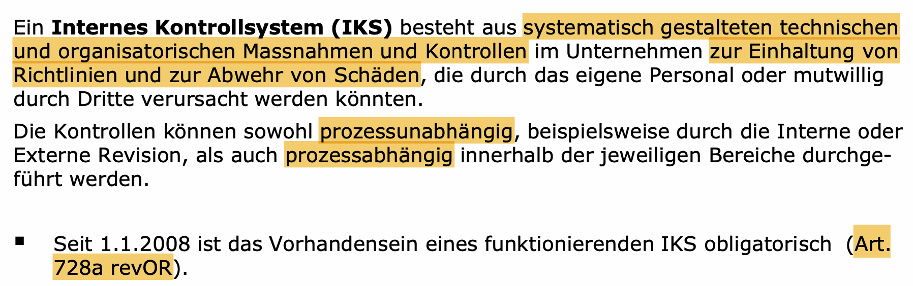

# Umsetzung Sicherheitspolitik und Konzepte

**IS / ICT Security Policy:** Als oberstes Objekt \(siehe Folie 38-40\). Dabei sollen die folgende Punkte \(**fett** markiert\) herausgehen:

* **Sehr zentral ist der Wille der GL** - soll im Dokument festgehalten werden
* Definition von Sicherheits-Ziele: Was will genau erreicht werden, für welche Assets
* **Awareness** verankern: Wichtig, dass die Konzernleitung ein zentraler Punkt ist und die Schulung der MA zentral ist
* Verankerungen von **Rahmenbedingungen**: Wesentliche Gesetzlichen-Grundlagen, Policy der Unternehmen \(Code of practise\) =&gt; wichtig zum Fokussieren der Ziele
* **Geltungsbereich** der Policy: Wie weit soll sie reichen
* **Schutzobjekte** festlegen: Aggregierte Ebene wo definiert ist, was zu den zentralen Schutzobjekten / Werte gilt
  * Vier fünf zentralsten Punkte erwähnen
* Verhältnismässigkeit / Wirtschaftlichkeit: Chancen-Risiko-Mgmt
  * Auch zu überlegen, ob Risiken eingegangen werden, um evtl. an einem anderen Ort eine Change zu ermöglichen - nahe am Risk-Management
* **Verantwortlichkeiten**: Die wesentlichen Rollen sollen geregelt werden
* Thema Klassifizierung / Assessment-Management
* Abweichungen festlegen: wer darf mit Abweichungen umgehen, unter welchen Umständen

## Die Sicherheit wird für die Sicherstellung der Geschäftsprozesse **immer wichtiger**

## Einflussfaktoren auf ein Security Framework _\*\*_

* **Von Aussen**
  * Gesetzliche Vorgaben: BAKOM \(Swisscom\), FINMA \(Banken\), etc.
  * Gesellschaft: Soziale Ungleichgewichte in der Bevölkerung
    * Hintergrund zu Hause, etc. -&gt; Einfluss auf die Arbeitsmethodik, etc.
  * Wirtschaft: Druck aus der Wirtschaft; Lizenzmodell - KMU ist in der Verhandlung mit MS relativ gebunden - Druck irgendwas zu tun
  * Kunde \(Wirtschaftlich / Gesellschaftlich\): Wie aktuell mit der Pandemie; grosser Einfluss auf die Unternehmung
* **Von Innen**
  * Akzeptanz der Mitarbeiter gegenüber Policy / Vorgaben
  * Geschäftsprozesse und dessen Abhängigkeiten
  * Unternehmensstrategien & Divisions-Strategie
  * Wirkung auf Partner und Töchter
    * Zukauf von Firmen
    * Tochter unabhängig gest
* Regulatorische Einflussfaktoren
* Internes Kontrollsystem
* Markt- und Technolgieumfeld \(Trends im Business, Auswirkungen auf ICT Security\)
* Sourcing
* Risikobereitschaft ermitteln
* Trends/Ausrichtungen/Wandel der Anforderungen an die Security beachten
* Geschäftsnutzen des Security Management Systems erheben

### Regulatorische Einflussfaktoren

### Sourcing Sicherheitsleistungen

### Was benötige ich alles für den Aufbau eines «Information Security Framework»?

## Aufbau eines Information Security Frameworks

* Welchen Standards gibt es?
  * BSI Grundschutz
  * ISO 27001
  * Cobit
  * Externe Regulativen: DSG, StgB
* Die Auswahl des richtigen Standards
  * Muss auf Rahmenbedingungen und Unternehmen passen
* Die richtigen Darstellungen wählen
* Sicherheitsmangement System, das die 3 Handlungsebenen aufzeigt 

## Was sollte bei der Erstellung einer IS/ICT Security Policy beachtet werden?

* Kommt der Wille der Konzern-/Geschäftsleitung zum Ausdruck?
* Ziele und Definition der Informationssicherheit vorhanden?
* Awareness verankert?
* Verankerung von Rahmenbedingungen sichergestellt?
* Geltungsbereich der Policy festgelegt? - Verbindlichkeiten definiert
* Sind die schützenswerten Objekte \(Kategorien\) grob benannt? 
* Ist die Verhältnismässigkeit / Wirtschaftlichkeit definiert?
* Sind die Verantwortlichkeiten klar? / Ist die Organisation definiert? 
* Ist das Thema Klassifizierung festgelegt und sind Assessments definiert? 
* Ist der Umgang mit Abweichungen festgelegt? 
* Grundsätzliches:
  * Umfang des Dokumentes
  * Klassifikation des Dokumentes
  * Inhaltliche Zusätze notwendig \(z.B. aufgrund spezieller Unternehmung\)?
  * Zielpublikum: Wer soll das Dokument lesen und verstehen?
  * Erarbeitung: Wer soll alles an dem Dokument mitarbeiten?
  * Genehmigungsunterschrift auf dem Dokument?

## Internes Kontrollsystem \(IKS\) - Definition \(Folie 14\)

