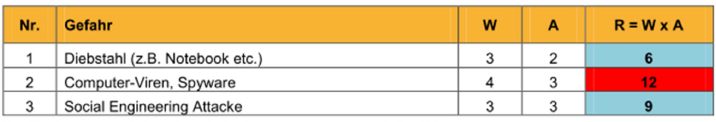

# Vorgehen: Risikonanalyse

* Grundschutz wird für standardisierte Massnahmen und generelle Risikobetrachtung verwendet
* Risikoanalyse bietet spezifische Massnahme und eine detaillierte Risikobetrachtung

## Risiken im Unternehmen

## Risiken im Bereich der IT-Organisation

* Organisatorische Risiken
  *  Schutz von Info. und Appl. vor unzulässigen Zugriffen
  * Anwendungsprogramme werden nicht prozessbezogen eingesetzt
  * Fehlende oder falsche Fachkompetenz
  * Mangelnde Testverfahren
  * Datendiebstahl
* Infrastrukturelle Risiken
  * IT-Infrastruktur kann den Ansprüchen nicht gerecht werden
  * Kein Sicherungskonzept, Notfallplan, Wiederanlaufsplan
  * Baulich-, technische-Standards werden nicht erfüllt \(Schutz vor Zutritt, Feuer und Energieausfall\)
  * Mangelnde Dokumentation
* Anwendungs- und Prozessbezogene Risiken
  * Veraltete und nicht integrierte Softwarelösungen \(Insellösungen\)
  * Fehlende strategische Neukonzipierungen
* Kosten- und leistungsbezogene Risiken
  * Kostentransparenz fehlt
  * Kostenüberschreitungen aufgrund mangelnder Projektdefinition
* Projektbezogene Risiken
  * Run-away-Projekte \(Zeit-, Kosten u/o Terminüberschreitungen\)
  * Kein professionelles Projekt-Management

## Risiko-Ermittlung

* Risiko = Schaden x Eintretenswahrscheinlichkeit

## Bedrohungen / Gefahren

* Gezielte Angriffe von aussen / innen
* Fahrlässigkeit
* Naturkatastrophen / Elementarschäden
* Data leakage
* Politische Instabilität
* Weitere Bedrohungen gemäss ISO 27005 für Interessierte auf Folie 265 - 267

## Risiko-Analyse

Zuerst müssen die vorhandenen Bedrohungen aufgelistet und eingestuft werden. Danach müssen die vorhandenen Schwachstellen ermittelt werden. Trifft eine Gefährdung auf eine Schwachstelle, dann entsteht eine Gefahr.

Ein Beispiel finden wir im Handbuch ab Seite 51.

### Schaden

### Eintretenwahrscheinlichkeit

### Risiko-Portfolio

* Hier wird das Risiko der einzelnen Gefahren abgeschätzt
* Das Risiko errechnet sich aus der Eintrittswahrscheinlichkeit \(W\) und dem Schadensausmass \(A\)

### Risikomatrix

* Mit der Matrix wird dargestellt, welchen Schaden man bei welcher Eintretenswahrscheinlichkeit akzeptiert \(Im Bsp. Akzeptiert man bei sehr seltenen Risiken einen kritischen Schaden\)

## Umgang mit IT-Risiken

Massnahmen mit den folgenden Attributen sollten wenn möglich eingesetzt werden:

* Grösste Wirkung
* Wenig Ressourcen
* Kurzfristig realisierbar
* Breite Akzeptanz

## Schwächen Grundschutz / Risikoanalyse

* Akzeptanz Grundschutz / Risikoanalyse heikel
* Mögliche Bedrohungen als Szenario
* Viele weiche Faktoren \(Schadenshöhe, Wahrscheinlichkeit, Massnahmen im Grundschutz\)
* Diskussionspotential gross
* Zu wenig eigene Vorfälle

