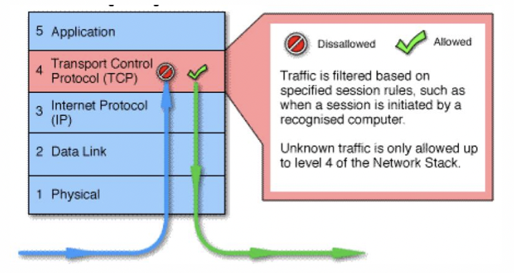

# Perimeter

## Schutz des Perimeter

* Als Perimeter wird üblicherweise der Übergang zwischen Internet und Intranet bezeichnet, gemeint ist also das Bindeglid zwischen Firmennetzwerk und dem Internet bzw. dem ISP.
* Rein funktional wird dafür eigentlich nur ein Router benötigt, je nach Situation und Sicherheitsbedürfnis reicht das aber nicht und es werden deshalb Paketfilter, Firewalls, ALGs etc. eingesetzt.

## Firewall

* Mehrere Komponenten \(Software + Hardware\)
* Zwischen 2 und mehrere Netzwerken
* Verkehr muss autorisiert werden \(Regeln\)
* Unterscheidung in 3 Generationen:
  * [Packet Filters](perimeter.md#paket-filter)
  * [Stateful Firewalls](perimeter.md#stateful-inspection-fw)
  * [Application Layer Gateway](perimeter.md#application-layer-gateways)

### Was kann eine Firewall nicht?

1. Eine Firewall kann nur Verbindungen schützen, die über sie laufen! \(Routing!?\)
2. Eine Firewall kann nicht bzw. nur bedingt vor bösartigen Insidern schützen
3. Eine Firewall wird bei einem erfolgreichen Angriff höchstwahrscheinlich keinen Alarm auslösen
4. Eine Firewall allein bietet keinen Schutz gegen das Versenden vertraulicher Dokumente und Informationen

Wichtig: Perimeter Security alleine genügt heute nicht

## Paket-Filter

* werden oft mit AccessLists \(ACLs\) implementiert
* gute Variante für Intrusion Detection

### Access Control List \(ACL\)

#### Ziele:

* Zugriff vom Internet ins interne Netz verboten
* Zugriff vom internen Netz ins Internet erlaubt

#### Bestehen oft aus:

* Source IP Address
* Destination IP Address
* Protocol Type \(TCP/UDP/ICMP\)
* Source Port Number \(TCP/UDP\)
* Destination Port Number \(TCP/UDP\)
* Flags \(TCP\)
* ICMP Type und Code

#### 1 ter Versuch:

* Ankommende Pakete verboten
* Abgehende Pakete erlaubt

#### 2 ter Versuch:

* Ankommende TCP Verbindungen verboten
* Abgehende TCP Verbindungen erlaubt

Dieses mal werden auch die TCP Flags beachtet. Probleme bestehen aber noch, z.B. werden die Portnummern nicht eingeschränkt.

#### Probleme:

* Schwierig zu konfigurieren
* Probleme mit gewissen Protokollen wie FTP \(ankommende Verbindung für FTP Data\)
* Jedes Paket wird einzeln kontrolliert \(keine Zusammenhänge zu vorhergehenden Paketen\)
* Probleme mit Protokollen mit dynamischen Port-Nummern
* Probleme mit bestimmten Angriffsarten wie z.B.
  * Pakete mit Source Port 20 \(TCP\) oder 53 \(TCP/UDP\)
  * Pakete mit gefälschter Source IP-Adresse
  * TCP ACK Paket ohne vorhergehendes SYN
* Paket-Inhalt \(Daten\) wird NICHT kontrolliert!

## Stateful Inspection FW

* Paket Filter mit "Intelligenz"
* Zusammenhänge zwischen Paketen werden berücksichtigt \("Stateful" im Vergleich zu "Stateless" wie bei Paket-Filter\)
* Je nach Implementation
  * Ports können bei Bedarf dynamisch geöffnet / geschlossen werden
  * Kein Problem mehr mit bestimmten Angriffsarten wie z.B.
    * TCP Pakete mit Source Port 20 \(bei FTP\)
    * TCP ACK Paket ohne vorherige SYN \(\*\)
  * Kein Problem mehr mit FTP

    – Kein Problem mit Protokollen die dynamische Port-Nummern verwenden

## Application Layer Gateways

* Werden auch Proxy genannt, Proxy ≡ Stellvertreter

### Vorteile:

* Einfacher zu konfigurieren im Vergleich zum Paket Filter. Keine vertiefte TCP/IP Kenntnisse erforderlich.
* Keine direkte Netzverbindung vom Internet ins interne Netz.
* Keine Probleme mit bestimmten Angriffsarten wie z.B.
  * TCP Pakete mit Source Port 20
  * TCP ACK Paket ohne vorherige SYN
* Relativ sicher im Vergleich zu Packet Filter.

### Nachteile:

* Relativ langsam im Vergleich zum Paket Filter.
* Unterstützung für gängige Netzwerk-Protokolle wie ftp, telnet, smtp usw. Falls neue oder nicht unterstützte Protokolle verwendet werden sollen, muss eine neue Firewall-Software entwickelt werden.

## Web Application Firewall

* Application-Layer Firewall zum Schutz eines oder mehreren Web-Server \(Loadbalancer\)
* Wird zusätzlich zum "normalen" Firewall verwendet \(nicht als Ersatz\)
* Schutz gegen SQL-Injection, XSS, usw. \(z.B. OWASP Top 10\)
* Je nach Produkt:
  * kann als Bridge, Router, Reverse Proxy oder auf dem Server selber installiert werden
  * kann als Blacklist \("negative security model"\) oder Whitelist \("positive security model"\) konfiguriert werden
  * Validierung von Cookies, Session State, User, usw.
* Pro-aktive Schutz gegen neue \(ev. noch nicht entdeckte\) Sicherheitslücken möglich

  19

  

### Nachteile / Probleme:

* Konfigurationsaufwand
  * Insbesondere bei der Erstellung einer Whitelist
  * Bei jedem Applikations-Release muss ggf. die Konfiguration angepasst werden
* Know-How Transfer Software-Entwickler→Firewall Administrator
* Herausforderungen:
  * False negatives \(bekannte Angriffsmethoden werden nicht erkannt\)
  * False positives

## Moderne Firewalls \(NGFW\)

* Techniken von professionellen \(stateful\) Firewalls,
* Intrusion Detection & Prevention Systemen \(IDP & IPS\)
* Applikations-Kontrolle \(mittels Deep-Packet-Inspection\)
* Kombination herkömmlicher Firewalls
* Externe Quellen werden hinzugezogen
* Bsp. Phishing-Website auf externen Blacklist, wird direkt gesperrt

### Firewalls heute

* Nicht zwingend teuer
* Produkte: Ubiquity, pfSense, OPNSense

### Personal Firewall

* Software für Rechner
* Auch moderne Betriebssysteme haben einfache FWs Integriert
* Bsp. Little Snitch 
* Bietet Schutz beim direktem Anschluss ans Internet \(z.B. Wireless\) oder beim Anschluss an andere Netzwerke \(z.B. Hotel\)
* Werden oft als integrierter Bestandteil eines "Internet Security" Produkt gekauft \(zusammen mit Anti-Viren-Software, usw.\)
* Heutige Personal Firewalls bieten Schutz nicht nur von ankommenden Verbindungen sondern auch von abgehenden.
* Kritikpunkte:
  * Schwierig zu konfigurieren: dürfen "services.exe" oder "winword.exe" auf das Internet zugreifen?
  * Oft falsch konfiguriert oder funktionieren nicht richtig

## Demilitarisierte Zone \(DMZ\)

* Einer der wichtigsten Begriffe im Zusammenhang mit Firewalls
* Heutzutage gibt es viele verschiedene Definitionen im Internet, einige davon sind jedoch falsch \(oder zumindest verwirrend\)
* "Klassische Definition":  **DMZ = Netzwerk zwischen dem geschützten Netzwerk \(inside\) und dem externen Netzwerk \(outside\)**
* Systeme, die vom Internet her zugreifbar sind, sollten in der DMZ installiert werden.

## Basic Firewall Rules

1. Direkter Zugriff vom Internet ins interne Netz grundsätzlich verboten.
2. Öffentlich zugängliche Web- und sonstige Server gehören in eine DMZ – und NICHT ins interne Netz
3. Zugriff vom Internet aus begrenzt auf bestimmte Server in der DMZ. Anzahl Dienste \(Ports\) möglichst begrenzt.
4. ALT: Zugriff vom internen Netz auf das Internet grundsätzlich offen. NEU: Zugriff vom internen Netz auf das Internet grundsätzlich untersagt \(limitiert "phone home tools"!\) , ausser bestimmten Diensten oder über Proxies.
5. Gefährliche Protokolle nicht zulassen \(soweit möglich\), z.B. NetBIOS, NFS, TeamViewer, ...

## FW - Wartung und Betrieb

* Software Upgrades/Updates
  * SW hat immer Sicherheitslücken
  * Wartungsvertrag
  * Periodisch updaten
* Backups
  * Auch für FW nötig
  * Konfigurationen, Regeln, Logs, OS?
* Change Control
  * Änderungsprotokoll \(Wer hat wann was gemacht?\)
  * Revisionssicherheit
  * Prozesse definieren
* Log-Files
  * Loglevels
  * Retention-Time
  * Externe System für Auswertung \(Splunk\)
* Firewall Outsourcing
  * FW von Firme gemanaged
  * Wichtige Fragen:
    * Wer definiert die Sicherheitsanforderungen?
    * Kundentrennung?
    * Recht auf Audit? \(Wer bezahlt?\)
* Firewall Management Tools

