# Untitled

Zusammenfassung: Informationssicherheit Management

Inhalt

[Grundlagen Informationssicherheit \(1. Foliensatz\) 4]()

[Übersicht 4]()

[Verschiedene Begriffe 4]()

[ISMS 4]()

[Information 4]()

[Grundziele der Informationssicherheit 4]()

[Identität / Authentizität 4]()

[Betriebssicherheit 5]()

[Risiko 5]()

[Informationssicherheit 5]()

[IT-Sicherheit / ICT-Sicherheit 5]()

[Datensicherheit / Datenschutz 5]()

[Zutritts-, Zugangs- und Zugriffskontrolle 5]()

[Diverse Bedrohungen 5]()

[Gründe für die Bedrohungen 5]()

[Standards der Informationssicherheit 7]()

[ISO Standards 7]()

[BSI-Standards 8]()

[IT Grundschutz 9]()

[ISF 10]()

[Vorteile von Standards 11]()

[Analyse \(Soll/Ist-Vergleich\) \(2. Foliensatz\) 12]()

[Vorgehen 12]()

[Prozesse / Objekte ermitteln 12]()

[Klassifizierungskriterien festlegen 12]()

[Abhängigkeitsmatrix 12]()

[Netzzonenplan 12]()

[Checklisten definieren 12]()

[Kontrollkriterien festlegen 13]()

[Sol-Ist-Vergleich 13]()

[Auswertung 13]()

[Nächste Schritte 13]()

[Häufigste Fehler 13]()

[Politik – Konzepte – Regelwerk – Prozess 13]()

[Sicherheitspyramide 13]()

[Sicherheitspyramide nach BSI 14]()

[Sicherheitspyramide nach Königs 14]()

[Dokumentstruktur nach Königs 15]()

[Sicherheitspyramide nach IT-Sicherheitshandbuch 15]()

[Informationssicherheitspolitik \(ISP\) \(1. Stufe\) 15]()

[Definition 15]()

[Ziele 16]()

[Grundlagen 16]()

[Compliance \(Gesetze / Verträge\) 16]()

[Richtlinien 16]()

[\(Wichtigste\) Rollen der Sicherheitsorganisation 16]()

[Checkliste ISP 16]()

[Informationssicherheitskonzepte \(ISK\) \(2. Stufe\) 16]()

[Definition 16]()

[Ziele 17]()

[Vorlagen zu Sicherheitskonzepten 17]()

[Weitere Sicherheitskonzepte 17]()

[Regelwerk / Massnahmenkatalog \(3. Stufe\) 17]()

[Beispiele von Richtlinien 18]()

[Zusammenhang ISP / ISK / Regelwerk 18]()

[Informationssicherheits-Prozess 18]()

[Beispiel 19]()

[Vorgehen Grundschutz \(3. Foliensatz\) 20]()

[Bemerkungen 20]()

[Anwendungsweisen 20]()

[Grundregeln zur Anwendung des Grundschutzkatalogs 20]()

[IT-Sicherheitskonzeption 20]()

[IT-Strukturanalyse 21]()

[Netzplanerhebung 21]()

[Komplexitätsreduktion 21]()

[Erhebung der IT-Systeme 21]()

[Erhebung der IT-Anwendungen 21]()

[Schutzbedarfsfeststellung 21]()

[Vorgehen 21]()

[Individualisierung der Schutzbedarfskategorien 21]()

[Schutzbedarf IT-Anwendungen 21]()

[Schutzbedarf IT-Systeme 21]()

[Schutzbedarf Kommunikationsverbindungen 22]()

[Schutzbedarf IT-Räume 22]()

[Interpretation der Ergebnisse 22]()

[IT-Grundschutzanalyse 22]()

[Vorgehen Modellierung 22]()

[Basis-Sicherheitscheck 23]()

[Vorgehen 23]()

[Ergänzende Sicherheitsanalyse 23]()

[Mögliche Vorgehensweisen 23]()

[Realisieren der Massnahmen 23]()

[Vorgehen Risiko-Analyse 24]()

[Risiken im Unternehmen 24]()

[Risiken im Bereich der IT-Organisation 24]()

[Risiko-Ermittlung 25]()

[Bedrohungen / Gefahren 25]()

[Risiko-Analyse 25]()

[Schaden 26]()

[Eintretenwahrscheinlichkeit 26]()

[Risiko-Portfolio 26]()

[Risikomatrix 26]()

[Umgang mit IT-Risiken 27]()

[Schwächen Grundschutz / Risikoanalyse 27]()

## Grundlagen Informationssicherheit \(1. Foliensatz\)

### Übersicht

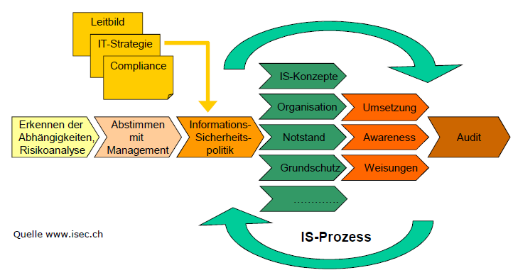

### Verschiedene Begriffe

#### ISMS

* Legt fest, mit welchen Instrumenten und Methoden das Management die auf Informationssicherheit ausgerichtete Aufgaben und Aktivitäten nachvollziehbar lenkt.
* Besteht aus den Komponenten
  * Mgmt-Prinzipien
  * Ressourcen
  * MA
  * IT-Sicherheitsprozess bestehend aus
    * IT-Sicherheitspolitik \(Strategie\)
    * IT-Sicherheitsorganisation \(Hilfsmittel z. Umsetzung\)
    * IT-Sicherheitskonzept \(Hilfsmittel z. Umsetzung\)

#### Information

* Verknüpfung von Daten in Form von Zahlen, Worten, Fakten zu interpretierbaren Zusammenhängen. Dadurch entsteht Wissen.
* Mit Hilfe von Interpretationsvorschriften aus Daten gewonnen
  * Einfache Interpretationsvorschrift: ASCII Code; Daten ungeschützt
  * Komplexe Interpretationsvorschrift: Verschlüsselung; Daten geschützt

#### Grundziele der Informationssicherheit

**Vertraulichkeit**  
Informationen können nicht durch unautorisierte Personen, Instanzen oder Prozesse eingesehen werden.

**Integrität**  
Daten oder Systeme können nicht unautorisiert manipuliert werden.

**Verfügbarkeit**  
Funktionalität von Soft- und Hardware kann nicht unbefugterweise beeinträchtigt werden.

**Verbindlichkeit**  
Alle Aktionen einer Instanz können eindeutig zugeordnet und nicht geleugnet werden.

#### Identität / Authentizität

**Identität** Bezogen auf Wesen bezeichnet Identität zumeist die Selbigkeit dieses bestimmten Wesens

**Authentizität** Sichere Zuordnung einer Information zum Sender und der Nachweis, dass die Information nach dem Versand nicht mehr verändert wurde.

#### Betriebssicherheit

* konsistente und gewünschte Funktionen und Verhalten der Daten und Systeme kann sichergestellt werden.
* Voraussetzung für Integrität und Verbindlichkeit

#### Risiko

* Negative Abweichung von einem erwarteten Zustand bezogen auf ein sicherheitsrelevantes Objekt in einem Zielsystem durch ein gefährdendes Ereignis mit verschiedenen wahrscheinlichen Ausprägungen.
* Eintretenswahrscheinlichkeit und negative Zielabweichung kann bewertet werden
* Korrelation zwischen Sicherheit und Risiko

#### Informationssicherheit

* Mehr als nur das Sicherstellen von Computerdaten: Sicherung der längerfristigen Geschäftstätigkeiten und Schutz des Wissens der MA
* Sicherheit in der Verarbeitung von Information
* Dient dem Schutz von Information
* Unabhängig von Medium

#### IT-Sicherheit / ICT-Sicherheit

* Schutz der Information in ICT Systemen
* Medium sind ausschliesslich ICT Systeme

#### Datensicherheit / Datenschutz

**Datensicherheit** Schutz der Daten und Datenträger

**Datenschutz** Schutz der Persönlichkeit und der Grundrechte von Personen, über die Daten bearbeitet werden.

#### Zutritts-, Zugangs- und Zugriffskontrolle

**Zutrittskontrolle** Schutz des physischen Systems, gerätebezogen

**Zugangskontrolle** Schutz des logischen Systems, personenbezogen

**Zugriffskontrolle** Schutz der Operationen, datenbezogen

### Diverse Bedrohungen

* Angriffe über’s Internet
* Abhören und Modifizieren von Daten
* Viren: Sind das Eingangstor
* Würmer: nutzen undichte Stellen in Programmen
* Bots: installieren sich selbst mit Hilfe von Viren / Würmer, Bestandteil von Bot-Netzen
* Trojaner, Malware
* Drive by Infection
* Private HW / SW \(z.B. IPhone\)
* Wirtschaftsspionage \(Bsp. Boeing-Airbus in USA\)

#### Gründe für die Bedrohungen

* Menschliches Fehlverhalten \(Fehlmanipulation, Übermüdung, Unwissen etc.\)
* Organisatorische Schwachstellen \(Fehlende Weisungen, unzureichende Zutrittskontrollen, falsche Zugriffsrechte etc.\)
* Technisches Versagen \(Netzwerkausfall, Ausfall Disk-System, mangelnde Kompatibilität etc.\)
* Höhere Gewalt \(Feuer, Blitz, Sturm, Überschwemmungen, Krankheiten etc.\)
* Gesetzliche Mängel \(Nicht einhalten der Gesetze, Reglemente \(Compliance\) etc.\)

## Standards der Informationssicherheit

### ISO Standards

**ISO 27001 : 2005 Information Security Management System ISMS**

* Prozess der Informationssicherheit
* Ursprünglich British Standard BS 7799-2
* Definiert Sicherheitsprozess nach Modell „Plan, Do, Check, Act“
* Zertifizierung möglich
* Für Unternehmen, für welche das Vertrauen der Kundschaft wichtig ist
* Im Anhang sind die Controls definiert; diese referenzieren auf ISO 27002

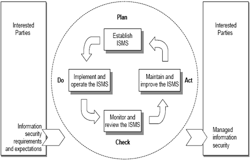

* **Planen**: Festlegen des ISMS - Erstellung der jeweils für das Risikomanagement und zur Informationssicherheitsverbesserung relevanten ISMS-Richtlinien, Zielsetzungen, Prozesse und Prozeduren zur Erzielung von Ergebnissen gemäß den Gesamtrichtlinien und –Zielsetzungen einer Organisation. - IT-Sicherheitsrichtlinie \(Politik\) dient als Unterstützung
* **Machen**: Umsetzen und Durchführung des ISMS - Einführung und Durchführung der ISMS-Richtlinien, -Kontrollen, -Prozesse und –Prozeduren. - Erstellung des IT-Sicherheitskonzeptes - Schutzbedarf definieren - Massnahmen planen
* **Prüfen**: Überwachen und Überprüfen des ISMS - Beurteilung und, wo maßgebend, Messung des Prozesserfolgs gegenüber den ISMS-Richtlinien, -Zielsetzungen und praktischen Erfahrungen, sowie Berichterstattung über die Ergebnisse an das Management zwecks Revision. - In einer KMU kann auf diesen Schritt verzichtet werden
* **Handeln**: Erhalten und Verbessern des ISMS - Ergreifung korrigierender und vorbeugender Maßnahmen, basierend auf den Ergebnissen des ISMS-Audits und der Management-Revision oder anderen relevanten Informationen zur Erzielung einer laufenden Verbesserung des ISMS. - Kosten und Kapazitätsplanung - Durchführung von Notfallübungen / Sensibilisierungsmassnahmen

**ISO 27002 : 2007 Code of Practice for Information Security Management**

* Ursprünglich BS 7799-1
* Prüfpunkte für sicheren Umgang mit Informationen \(z.B. was muss unternommen werden, wenn ein MA aus dem Unternehmen austritt, Notfallplanung etc.\)
* Definiert Zielsetzungen
* Keine detaillierten Massnahmen
* Keine Zertifizierung möglich
* Ca. 160 Prüfpunkte \(Controls\) für den sicheren Umgang mit Informationen

ISO 27004 : 2009 Information Security Measurement

* Definition von Kennzahlensystemen für ISMS
* Inkl. Richtlinien, Informationssicherheit-Risiko-Management, Kontrollen, Verfahren
* Hilft bei Erkennung ob ISMS Prozesse verändert werden müssen

ISO 27005 : 2008 Information Risk

* Modelle für das Risiko-Management
* Risiko-Management-Prozess
  * Kontext bestimmen
  * Risiko-Identifikation / Risiko Einschätzung
  * Risiko-Bewertung
  * Risiken managen, Massnahmen priorisieren, planen umsetzen
* Ab S. 55 im Handbuch

### BSI-Standards

**BSI 100-1: Managementsysteme für Informationssicherheit** \(entspricht ISO 27001\)

* Zielgruppe: Management
* Definiert allg. Anforderungen an ein ISMS
* Integriert aktuelle ISO 2700x Standards
* Enthält Hinweise zur Zusammenarbeit Sicherheitsmgmt. & Datenschutz
* Beantwortet die folgenden Fragen
  * Was sind die Erfolgsfaktoren beim Management von Informationssicherheit?
  * Wie kann der Sicherheitsprozess vom verantwortlichen Management gesteuert und überwacht werden?
  * Wie werden Sicherheitsziele und eine angemessene Sicherheitsstrategie entwickelt?
  *  Wie werden Sicherheitsmaßnahmen ausgewählt und ein Sicherheitskonzept erstellt?
  * Wie kann ein einmal erreichtes Sicherheitsniveau dauerhaft erhalten und verbessert werden?

**BSI 100-2: IT-Grundschutz-Vorgehensweise**

* Aufbau und Betrieb eines ISMS in der Praxis
* Anleitungen zu
* Aufgaben des Sicherheitsmanagements
  * Etablierung einer Organisationsstruktur für Informationssicherheit
  * Erstellung Sicherheitskonzept
  * Auswahl Sicherheitsmassnahmen
* Neuer Fokus auf Informationssicherheit & Geschäftsprozesse
* Integration von Datenschutz-Aspekten
* Antworten zu
  * Etablieren eines ISMS
  * Erarbeiten eines IT-Sicherheitskonzepts
  * Anzuwendende Massnahmen bestimmen
  * Durchführen einer Standortbestimmung

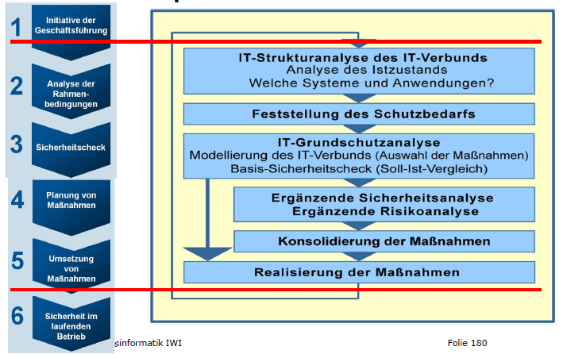

**BSI 100-3: Risikoanalyse auf Basis von IT-Grundschutz**

* Ergänzende Sicherheitsanalyse wenn
  * Hoher Schutzbedarf
  * Zusätzlicher Analysebedarf
  * Keine geeigneter Baustein im IT-Grundschutz
* Zweistufiges BSI-Modell
  * Stufe 1
  * Normaler Schutzbedarf, übliche Einsatzszenarien
  * Qualitative Methode zur Risikoanalyse und –bewertung
  * Stufe 2
  * Höherer Schutzbedarf, unübliche Einsatzszenarien
  * Vereinfachte Risikoanalyse und -bewertung
  * Vgl. Folie 184

**BSI 100-4: Notfallmanagement**

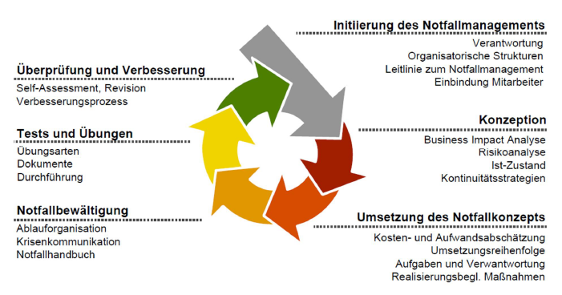

### IT Grundschutz

Der IT Grundschutz bietet eine **Vorgehensweise für den Aufbau eines Managementsystems für Informationssicherheit** sowie eine umfassende Basis für die **Risikobewertung**, die **Überprüfung des vorhandenen IT-Sicherheitsniveaus** und die **Implementierung der angemessenen IT-Sicherheit.**

Der IT Grundschutz-Katalog besteht aus den folgenden Teilen:

**Bausteine**

* Kurzbeschreibung für die betrachteten Komponenten, Vorgehensweisen & IT-Systeme
* Überblick über Gefährdungslage & Massnahmenempfehlungen
* B1 Übergreifende Aspekte der Informationssicherheit
* B2 Sicherheit der Infrastruktur
* B3 Sicherheit der IT-Systeme
* B4 Sicherheit im Netz
* B5 Sicherheit in Anwendungen

**Gefährdungskataloge**

* Ausführliche Beschreibungen der Gefährdungen
* G1 Höhere Gewalt
* G2 Organisatorische Mängel
* G3 Menschliche Fehlhandlungen
* G4 Technisches Versagen
* G5 Vorsätzliche Handlungen

**Massnahmenkataloge**

* Beschreibt die in den Bausteinen zitierten Sicherheitsmassnahmen
* M1 Infrastruktur
* M2 Organisation
* M3 Personal
* M4 Hard- und Software
* M5 Kommunikation
* M6 Notfallvorsorge

**Vorteile**

* Extrem ausführliche und detaillierte Beschreibung \(ca. 3000 Seiten! Vergleich ISO: ca. 250 Seiten\)
* Geht auf spezifische Probleme ein \(z.B. Probleme zum Windows Server\)
* Zertifizierung möglich
* Aufwand der Risikoanalyse wird stark reduziert
* Führt schnell zu einem relativ hohen Niveau an Sicherheit gegen die häufigsten Bedrohungen.
* Stark verbreitet und relativ kostengünstig

**Nachteile**

* Ungenügender Schutz bei erhöhten Risiken oder Schutzbedarf
* Mögliche Einschränkung der Funktionalität durch Überschutz
* Begründung von Massnahmen erschwert
* Je nach Detaillierungsgrad Pflege der Aktualität und Vollständigkeit des Massnahmenkataloges aufwändig

### ISF

* Information Security Forum, non profit Organisation
* „\[…\] dedicated to benchmarking and identifying good practice in information security.”
* Input aus über 240 Organisationen weltweit
* Aufbau nach 6 Aspekten
  * Security Management
  * Critical Business Applications
  * Computer Infrastructure
  * Communications Networks
  * System Development
  * End User Environment
* Möglichkeit Suche nach verschiedenen Topics

### Vorteile von Standards

* Benchmarking mit anderen Unternehmungen
* Rechtliche Absicherung
* Standards decken alle Themen ab
* Im Auditing kann man die Standards vorlegen

Mehr Informationen zu den BSI Standards erhält man auf dem Internetauftritt von BSI:

https://www.bsi.bund.de/DE/Themen/ITGrundschutz/itgrundschutz\_node.html

## Analyse \(Soll/Ist-Vergleich\) \(2. Foliensatz\)

* Ausgehend von Prozessen/Anwendungen
* Auf die wesentlichsten Prozesse fokussieren
* Zusammenhang zwischen Informationen, Anwendungen und Systemen ermitteln
* Festlegen der Klassifizierung
  * Vertraulichkeit
  * Verbindlichkeit
  * Integrität

### Vorgehen

#### Prozesse / Objekte ermitteln

* Welche Prozesse existieren?
* Welche Prozesse sind besonders kritisch?
* Welcher Prozess benötigt welche Objekte \(Systeme, Applikationen, Informationen\)? Vgl. Abhängigkeitsmatrix
* Wer ist für welche Prozesse verantwortlich?

#### Klassifizierungskriterien festlegen

1. Vertraulichkeit \(öffentlich – intern – vertraulich\)
2. Verfügbarkeit \(Ausfall 5 Tage – 1 Tag – 4h\)
3. Integrität \(niedrig – mittel – hoch\)

#### Abhängigkeitsmatrix

* Gibt Übersicht über die Abhängigkeiten
* Integration Netzzonenplan
* Ableiten der grössten Risiken
* Unterschiedliche Farben entsprechen unterschiedlichen Gefährdungslevels
* Zeilen
  * Welche Applikationen sind für den Prozess notwendig?
* Spalten
  * Welche Gruppen von Systemen bestehen?
* Beispiel Folie 98

#### Netzzonenplan

* Unterteilung in Teilnetze unterschiedlicher Bedrohungen
* Bedrohungssicht und Verbindungssicht mit zulässigen Verbindungen
* Farblich kennzeichnen
* Beispiel Folie 99

#### Checklisten definieren

* Weiteres Verdichten der Objekte \(System/Applikationen\)
* Mögliche Kriterien zur Zusammenfassung
  * Gleiche Verantwortung
  * Gleicher Ansprechpartner
  * Ähnliche Klassifizierung
* Konzentration auf’s Wesentliche
* Prioritäten setzen
* Stufenweise aufbauen
* Beispiele für typische Checklisten
  * Server
  * Clients
  * Netzwerk-Komponenten
  * Räume

#### Kontrollkriterien festlegen

* Relevante Prüfpunkte basierend auf Standardwerken \(z.B. ISO 27002\) festlegen

#### Sol-Ist-Vergleich

* Vergleich Vorgaben mit effektiver Situation
* Mögliche Vorgehensweisen
  * Interviews
  * Begehungen vor Ort
  * Studium der Dokumentationen
  * Erfahrung

#### Auswertung

* Erkennen des Handlungsbedarfs
* Versteckte Informationen herausschälen
* Prioritäten beurteilen

#### Nächste Schritte

* Allfällige Sofortmassnahmen einleiten
* Weiteres Vorgehen und Verantwortlichkeiten festlegen
* Prioritäten definieren, Termine festsetzen

#### Häufigste Fehler

* Falsches Image \(Ankläger statt Coach\)
* Zu detailliert, zu viele Checklisten
* Unrealistische Termine
* Mangelnde Unterstützung durch das Management

## Politik – Konzepte – Regelwerk – Prozess

### Sicherheitspyramide

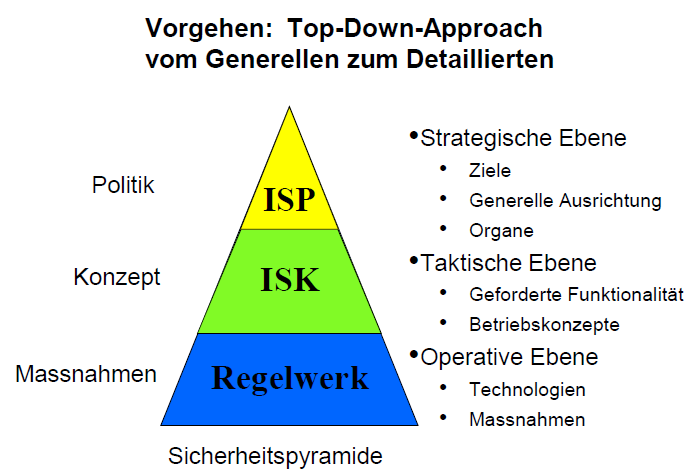

### Sicherheitspyramide nach BSI

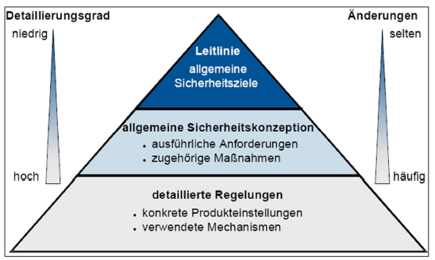Dokumentstruktur nach BSI

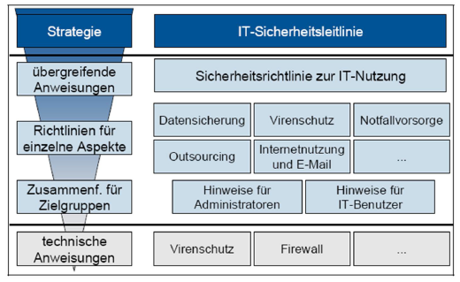

### Sicherheitspyramide nach Königs

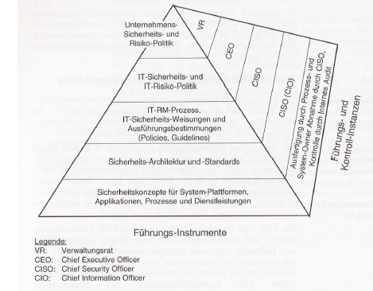

### Dokumentstruktur nach Königs

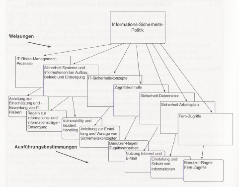

### Sicherheitspyramide nach IT-Sicherheitshandbuch

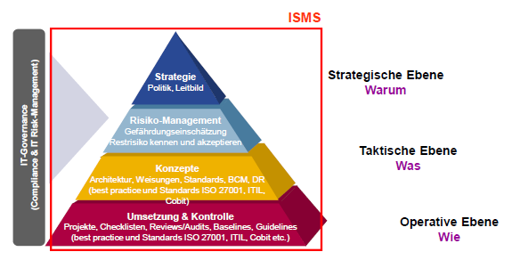

### Informationssicherheitspolitik \(ISP\) \(1. Stufe\)

#### Definition

„Im Bereich der IT-Sicherheit oberste Richtlinie einer Organisationseinheit in der sicherheitsrelevante Bestimmungen zu Verhaltensweisen von Mitarbeitern und von IT-Systemen \(IT, Informationstechnologie\) festgehalten werden.“ [www.datenschutz-praxis.de](http://www.datenschutz-praxis.de/)

Aussagen zu:

* IT-Sicherheitsziele
* Bezug IT-Sicherheitsziele -&gt; Geschäftsziele
* Angestrebtes Sicherheitsniveau
* Wie wird das Sicherheitsniveau erreicht?
* Definition der IT-Sicherheitsorganisation \(Bsp. Buch S. 43\)

#### Ziele

* Strategische Ebene
* Klares Statement des Management \(Vorbild\)
* Bezugspunkt für die gesamte Informationssicherheit

#### Grundlagen

* Unternehmenspolitik
* Unternehmenskultur
* Gesetze / Verträge
* Anforderungen an Vertraulichkeit / Verfügbarkeit
* Organisation der Unternehmens
* Grundsätze \(z.B. alles ist erlaubt, was nicht verboten ist\)

#### Compliance \(Gesetze / Verträge\)

* OR / StGB
* Datenschutzgesetz
* Urheberrecht
* BÜPF / VÜPF \(wichtig wegen Internet / Email\)
* Verträge mit Kunden, Lieferanten, Mitarbeitenden etc

#### Richtlinien

* Leitplanken für Informationssicherheit
* Fokus Sicherstellung der Geschäftsfortführung \(!!\)
* Generelle Willensäusserung der GL bezüglich Sicherheitslevel
* Widerspiegelt UN-Kultur
* Abgeleitet von UN-Politik
* Muss unbedingt von GL getragen werden
* Wirtschaftliche Aspekte, Kostenfolgen aufzeigen \(!!\)
* Langfristige Betrachtung \(3-5 Jahre\)

#### \(Wichtigste\) Rollen der Sicherheitsorganisation

* GL / Management \(trägt die Verantwortung / Risiko!\)
* Informationssicherheitsbeauftragter \(sollte nicht aus dem Bereich IT stammen!\)
* Mitarbeitende

### Checkliste ISP

Ein ISP Dokument sollte folgende Punkte abdecken:

* Vorwort / Einordnung / Motivation
* Geltungsbereich und Abgrenzung
* Grundlagen \(Gesetzte, übergeordnete Dokumente\)
* Ziel und Zweck ISP \(Sicherstellen Geschäftsvorgang\)
* Sicherheitsziel und –strategie IT
* Rollen und Verantwortlichkeiten
* Umgang mit Risiken, Wirtschaftlichkeitsaspekte
* Zuwiderhandlungen
* Life Cycle
* Unterschrift
* Lesbarkeit / Aufmachung / Umfang / Publizierung
* Realisierbarkeit

### Informationssicherheitskonzepte \(ISK\) \(2. Stufe\)

#### Definition

„Das projektbezogene Informationssicherheitskonzept enthält alle an das zu entwickelnde System verbindlich gestellten **Informationssicherheitsanforderungen** und die **Informationssicherheitsmaßnahmen** zum Schutz der Informationen **vor Verlust der Integrität, Verbindlichkeit, Vertraulichkeit und Verfügbarkeit** sowie die Informationssicherheitsanforderungen und Informationssicherheitsmaßnahmen zum **Schutz der technischen Anlagen** zur Informationsverarbeitung und Informationsübermittlung.“ http://v-modell.iabg.de/v-modell-xt-html/1237011884b74d1a.html

#### Ziele

* Taktische Aussagen
* Rahmenbedingungen für Teilbereiche festlegen
* Übergeordnete Definitionen

#### Vorlagen zu Sicherheitskonzepten

* Auf hohen Abstraktionsniveau dargestellte Bereiche von Sicherheitsmassnahmen
* Formuliert die groben, längerfristig geltenden Ziele eines Bereiches des Informationssicherheit
* Basiert auf der Info-Sicherheitspolitik
* Definiert den Umgang mit verschieden zentralen Elementen der Informationssysteme
* Mittelfristige Geltungsdauer \(1-3 Jahre\)

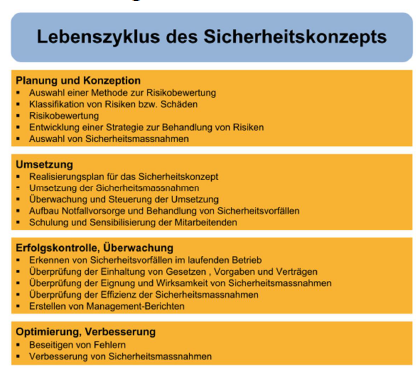

#### Weitere Sicherheitskonzepte

* Konzept zur Vergabe der Benutzerrechte / Rollen \(Wer hat worauf Zugriff? Mitarbeiteraustritte?\)
* Change Management Policy \(Wie gehe ich mit Veränderungen / neuen Releases um?\)
* Notfallkonzept \(Was passiert bei grösseren Ausfällen?\)
* Weitere siehe Folie 136
* Beispiel für Inhalt IS-Konzept befindet sich auf Folie 137

### Regelwerk / Massnahmenkatalog \(3. Stufe\)

* Bildet die unterste Schicht der Sicherheitspyramide
* Formuliert die Detailziele \(müssen regelmässig angepasst werden\)
* Werden von den Konzepten abgeleitet
* Basieren oft auf den Standardwerken wie ISO oder Grundschutzhandbuch

#### Beispiele von Richtlinien

* Sicherer Betrieb von Windows-Servern \(-&gt; Betriebshandbuch\)
* Sicherer Betrieb von Datenbanken
* Sicherheit am Arbeitsplatz \(-&gt; Benutzerrichtlinien\)
* Remote-Access \(-&gt; Sicherer Zugriff auf persönliche Daten z.B. via VPN\)
* Entsorgung von IT-Equipment \(-&gt; Daten sollen nicht in „falsche Hände“ geraten\)

### Zusammenhang ISP / ISK / Regelwerk

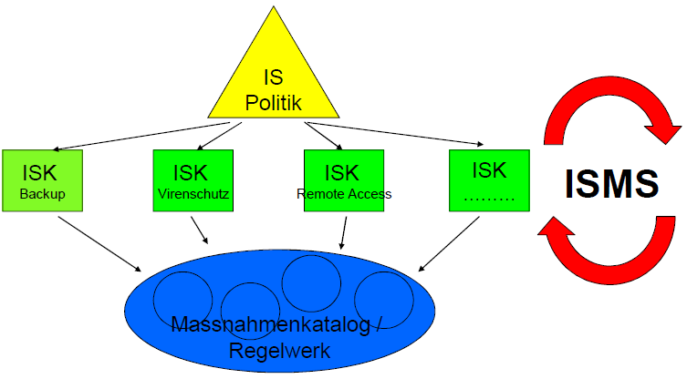

### Informationssicherheits-Prozess

* Vgl. Zusammenfassung S. 4
* Vgl. Handbuch S. 33 - 35
* Schrittweise wachsend
* Angepasst ans Unternehmen
* Umsetzbar und realistisch
* Stetig und konsequent
* Vergleich mit der Qualität
* Umdenken, Wechsel der Kultur \(-&gt;benötigt Zeit\)
* Muss von jedermann getragen und verstanden werden
* Läuft endlos weiter
* Muss selbstverständlich werden

Jedes Unternehmen ist ständigen dynamischen Veränderungen unterworfen und deshalb muss der IS-Prozess stetig durchgeführt werden:

* Veränderung der Infrastruktur
  * Neue Applikationen / Betriebssysteme
  * Neue Systeme \(Ausbau oder Ersatz\)
* Veränderung Umfeld / Rahmenbedingungen
  * Übernahmen von neuen Unternehmungen
  * Trennung von Unternehmungen \(sog. „Spin-off“\)
  * Neue Gesetzte / Verordnungen
  * Neue Verschlüsselungen
  * Neue Angriffsformen \(Trojaner, Malware, Phishing Attacks, Drive by Infection, Zero Day Attacks, Bots\)
  * Data Leakage \(Stichwort Wikileaks\)

Der IS Prozess kann folgende Elemente beinhalten:

* Risikobeurteilung
* Überzeugung der Unternehmensleitung
* Übersicht über die Prozesse / Mittel / Verbindungen
* ISP, ISK‘s, Regelwerk \(Massnahmen und Weisungen\)
* Sicherheitsorganisation
* Verfahren IT-Grundschutz
* Spezifische Risikoanalysen bei erhöhtem Schutzbedarf
* Audits \(eigene, interne, externe\)
* Werkzeuge zur Reduktion des Verwaltungsaufwands
* Awareness \(-&gt; alle mit einbeziehen, Management, Mitarbeiter etc.\)
* Notstand \(BCP – Business Continuity Planning, DRP – Disaster Recovery Planning\)
* Reporting \(regelmässig, bestätigen des Zustandes, rapportieren, werben\)

### Beispiel

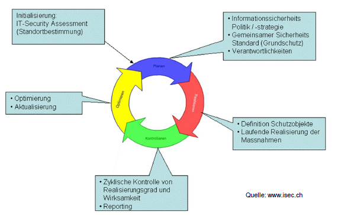

## Vorgehen Grundschutz \(3. Foliensatz\)

### Bemerkungen

* Keine Unterscheidung zw. Gefahren und Schwachstellen
* Empfehlungscharakter, keine Gesetze
* Keine Garantie auf Vollständigkeit
* Massnahmen müssen individuell angepasst und angewandt werden

### Anwendungsweisen

* Strukturanalyse
* Schutzbedarfsfeststellung
* Basis Sicherheits-Check
* Ergänzende Sicherheitsanalyse
* Umsetzung von IT-Sicherheitskonzepten
* Qualifizierung / Zertifizierung nach IT-Grundschutz

### Grundregeln zur Anwendung des Grundschutzkatalogs

* Initiative für IT-Sicherheit geht vom Management aus.
* Verantwortung für IT-Sicherheit liegt beim Management.
* Management muss um IT-Sicherheit bemüht sein, damit die Aufgabe wahrgenommen wird

### IT-Sicherheitskonzeption

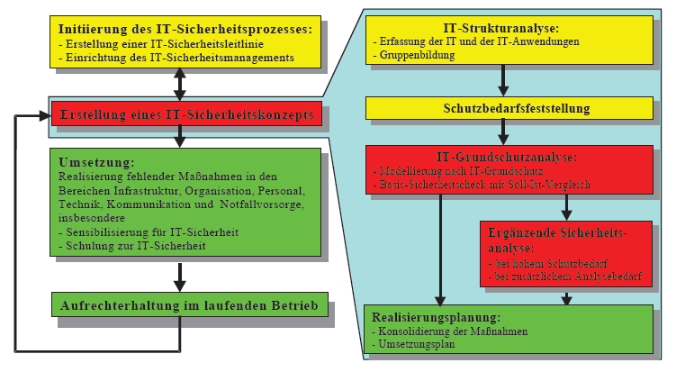

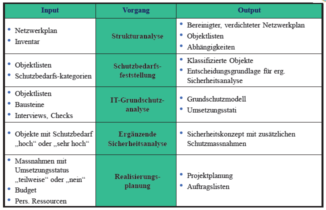

### IT-Strukturanalyse

#### Netzplanerhebung

* Auswertung eines Netzplans
* Aktualisierung des Netzplans

#### Komplexitätsreduktion

* Gleichartige Komponenten zu einer Gruppe zusammenfassen
* Eindeutige Bezeichnungen verwenden

#### Erhebung der IT-Systeme

* Vorhandene und geplante IT-Systeme zusammenstellen
* Tabellarische Darstellung empfohlen
* Eindeutige Bezeichnung, Beschreibung, Plattform, Standort, Anzahl, Status, Benutzer / Admin

Bsp. Ab S. 11 BSI Schulung

#### Erhebung der IT-Anwendungen

* Erfassung der wichtigsten Anwendungen
* Konzentration auf Systeme mit
  * höchsten Bedarf an Vertraulichkeit
  * höchsten Bedarf an Korrektheit \(Integrität\)
  * kürzeste tolerierbare Ausfalldauer \(Verfügbarkeit\)

Bsp. Ab S. 13 BSI Schulung

### Schutzbedarfsfeststellung

* Begründete und nachvollziehbare Einschätzung des Schutzbedarfs
* Ziel: angemessene Sicherheitsmassnahmen für die verschiedenen IT-Komponenten

#### Vorgehen

* Definieren und individualisieren der Schutzbedarfskategorien \(z.B. Niedrig bis mittel, hoch, sehr hoch\)
* Schutzbedarfsfeststellung der in Strukturanalyse erfassten Anwendungen
* Ableiten Schutzbedarf der IT-Systeme
* Feststellen Schutzbedarf Kommunikationsverbindungen
* Dokumentieren und interpretieren der Ergebnisse

#### Individualisierung der Schutzbedarfskategorien

* Individualisierung anhand von typischen Schadenszenarien
  * Beeinträchtigung des informationellen Selbstbestimmungsrechts
  * Beeinträchtigung der Aufgabenerfüllung
  * Negative Aussenwirkung \(Imageschäden\)
  * Finanzielle Auswirkungen

#### Schutzbedarf IT-Anwendungen

Zuordnung zu den zuvor festgelegten Schutzbedarfskategorien für alle in der IT-Strukturanalyse erfassten Anwendungen, differenziert nach den drei Grundwerten Vertraulichkeit, Integrität und Verfügbarkeit \(Bsp. Ab S. 17 BSI Schulung\).

#### Schutzbedarf IT-Systeme

Der Schutzbedarf eines IT-Systems hängt im Wesentlichen von dem Schutzbedarf derjenigen Anwendung ab, für deren Ausführung es benötigt wird. Der Schutzbedarf der Anwendung vererbt sich auf den Schutzbedarf des IT-Systems. Dabei lassen sich folgende Fälle unterscheiden:

* Maximumprinzip
  * Summe der Schäden der relevanten IT-Anwendungen
* Abhängigkeiten
  * Vernetzung und Schnittstellen zwischen IT-Anwendungen
* Kumulation
  * Der Schäden wenn mehrere IT-Anwendungen auf demselben System laufen
* Verteilungseffekt
  * Bei redundanter Auslegung von IT-Systemen

Bsp. Ab S. 21 BSI Schulung

#### Schutzbedarf Kommunikationsverbindungen

Als kritische Verbindungen gelten:

* Verbindungen in ein öffentliches Netz
* Verbindungen mit besonders schützenswerten Informationen
* Verbindungen, über die vertrauliche Informationen überhaupt nicht übertragen werden dürfen

Bsp. Ab S. 27 BSI Schulung

#### Schutzbedarf IT-Räume

Betrifft Räume

* Die zum Betrieb von IT-Systemen dienen \(z.B. Serverräume\)
* In denen IT-Systeme genutzt werden \(z.B. Büroräume\)

Bemisst sich nach dem Schutzbedarf der IT-Systeme, die sich in diesem Raum befinden. Es kann entweder das Maximumprinzip oder das Kumulationsprinzip angewendet werden.

Bsp. S. 29 BSI Schulung

#### Interpretation der Ergebnisse

* Niedrig bis mittel
  * Standard-Sicherheitsmassnahmen
* Hoch
  * Standard + optionale Massnahmen
* Sehr hoch
  * Standard + optionale Massnahmen
  * Zwingend ergänzende Sicherheitsanalyse

### IT-Grundschutzanalyse

Ziel der Modellierung gemäss IT-Grundschutz ist es festzulegen, welche Bausteine des IT-Grundschutzhandbuchs auf welche Zielobjekte der IT einer Organisation anzuwenden sind \(Ergebnis: IT- Grundschutzmodell\).

#### Vorgehen Modellierung

* Jeden Baustein auf Anwendbarkeit prüfen und zuweisen
* Gliederung anhand Schichtenmodell
  * Schicht 1: Übergreifende Aspekte
  * Schicht 2: Infrastruktur
  * Schicht 3: IT-Systeme
  * Schicht 4: Netze
  * Schicht 5: Anwendungen
* Vollständigkeitsprüfung
  * Quervergleich mit Netzplan
  * Alles vollständig nachgebildet?
  * Technik, Organisation, Personal, Infrastruktur?

Bsp. Ab S. 30 BSI Schulung

### Basis-Sicherheitscheck

Mit einem Basis-Sicherheitscheck ermitteln wir, ob und inwieweit die Massnahmen-Empfehlungen des IT-Grundschutzhandbuchs für die einzelnen Zielobjekte des betrachteten IT-Verbunds umgesetzt sind.

#### Vorgehen

* Im Grundschutz-Modell haben wir die anzuwendenden Bausteine ausgewählt, dies stellt nun eine Art Prüfplan dar.
* Nun überprüfen wir für jedes Zielobjekt und für jede Massnahme der entsprechenden Bausteine, ob sie überhaupt auf das Zielobjekt anzuwenden ist und inwieweit sie umgesetzt wurde.

Bsp. Ab S. 35 BSI Schulung

### Ergänzende Sicherheitsanalyse

Durchzuführen, wenn:

* Schutzbedarfskategorie „hoch“ oder „sehr hoch“ in mindestens einem der Grundwerte
* Zusätzlicher Analysebedarf besteht
* Für bestimmte Komponenten oder Aspekte kein geeigneter Baustein existiert

#### Mögliche Vorgehensweisen

* Risikoanalyse
  * relevante Bedrohungen ermitteln
  * Eintrittswahrscheinlichkeiten schätzen
* Penetrationstest
  * Verhalten eines Angreifers simulieren
  * Blackbox- und Whitebox-Ansatz unterscheiden
* Differenz-Sicherheitsanalyse
  * höherwertige Maßnahmen identifizieren
  * Schutzklassenmodelle

#### Realisieren der Massnahmen

Mit Hilfe eines Realisierungsplans

* Ergebnisse sichten
* Massnahmen konsolidieren
* Aufwand schätzen
* Umsetzungsreihenfolge festlegen
* Verantwortliche bestimmen
* Begleitende Massnahmen festlegen

Bsp. Ab S. 48 BSI Schulung

## Vorgehen Risiko-Analyse

* 
